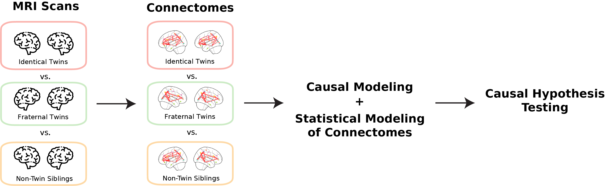
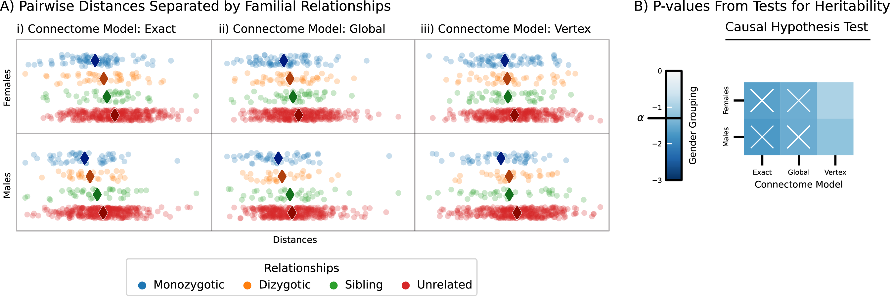
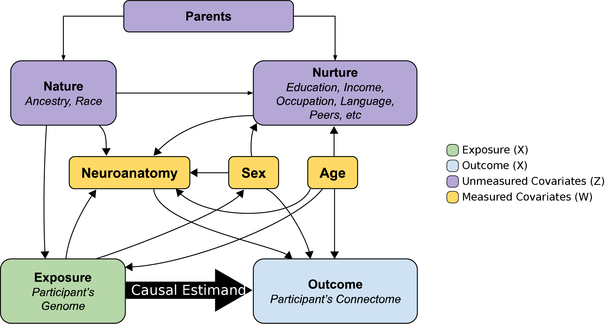
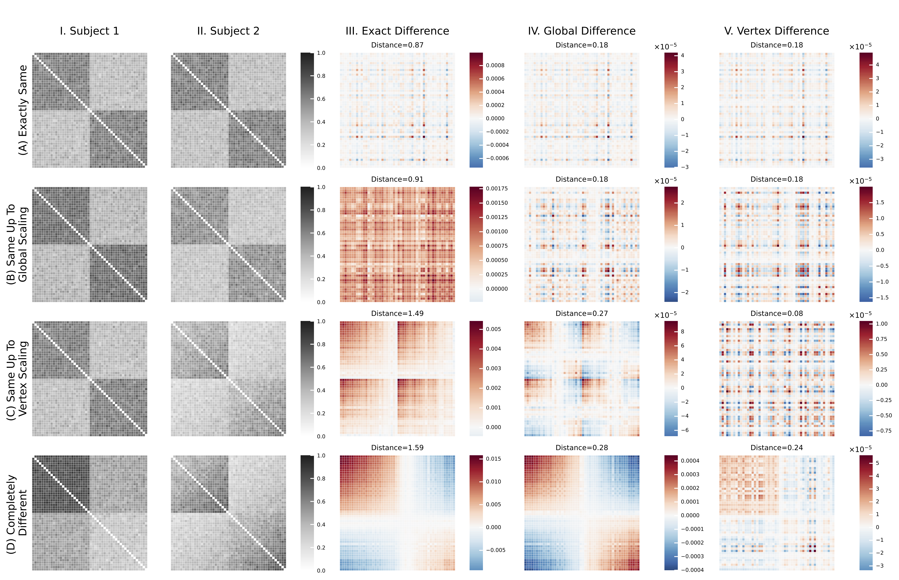

# Connectomic Heritability: a Causal Modeling Analysis

## Jaewon Chung

_(he/him)_ - [NeuroData lab](https://neurodata.io/)
_Johns Hopkins University - Biomedical Engineering_

 [_j1c@jhu.edu_](mailto:j1c@jhu.edu)
 [_@j1c (Github)_](https://github.com/j1c)
 [_@j1c (Twitter)_](https://twitter.com/j1c)

---

# How do we study connectomic heritability?

 

<!--
Heritability studies have led to numerous breakthroughs in our understanding of the genetic influences on various traits, behaviors, and diseases. For example, twin studies have shown that genetic factors play a significant role in the development of type 1 diabetes, and researchers have identified early markers of the disease, such as the presence of specific antibodies. This has led to the development of early screening programs and interventions focused on delaying or preventing the onset of type 1 diabetes in high-risk individuals.

With the availability of large-scale neuroimaging datasets, it is now possible to investigate the heritability of the connectome. The connectome is the network of neural connections in the brain, mapping the structural links between different brain regions. In essence, the connectome serves as a comprehensive blueprint of our brain. Connectomic heritability, then, is the study of how genetic factors contribute to individual differences in brain connectivity patterns. This is important because we believe that the connectome is a key determinant of brain function and behavior.

However, there are several challenges in studying connectomic heritability. Connectomes are high-dimensional, non-Eucledian, and non-linear data making current methods for studying heritability, which rely on strong distributional assumptions, inadequate. Furthermore,  most methods assume an associational effect between the genome and a specific trait, rather than a causal effect.

To address these limitations, we propose two solutions: first, we formalize heritability as causal effects. With a causal model, we can identify measurable covariates to control for unmeasured confounding, allowing us to make causal claims. Second, we leverage statistical models that capture the underlying structure and dependence within connectomes. This approach allows us to define different notions of connectome heritability by eliminating common structures, such as differences in connectome scaling.

With these solutions, we want to answer the question: do genomes cause connectomes?

To answer this question, we apply our analysis framework to connectomes estimated from the Human Connectome Project diffusion MRI data.
-->

---

  

<footer>

[Chung, Jaewon, et al. "Human Connectomes Are Heritable." bioRxiv (2023): 2023-04.](https://www.biorxiv.org/content/10.1101/2023.04.02.532875.abstract)

</footer>

<!--
Using the statistical models for connectomes, we can learn simplified, Euclidean representations called latent positions, and these latent positions allow us to measure the differences between pairs of connectomes. That is, differences between latent positions imply differences in connectomes.

Given these latent positions, we develop three separate, but related, ways of comparing them. First, the exact model is the simplest, and just measures all differences between latent positions.

Second, the global model examines whether the latent positions of one subject are a scaled version of the other. For example, if the total number of neural connections in our brains decrease as we age, we have no way of differentiating whether significant findings using the exact model are a result of differences due to neural decline or differences in the fundamental structure of the connectomes themselves.

So we develop the vertex model, which allows for each brain region to be scaled differently. This approach considers that, within the same hemisphere, different regions may have distinct preferences for forming connections with specific other regions. In the global and vertex models, we remove the effects of scaling and then compare the latent positions to understand if there is heritability beyond these scaling effects.

In panel A, we plot the differences between connectomes separated by familial relationships. Points toward the left in each column indicate smaller differences, while those on the right represent larger differences. Now, if we focus on the diamonds, which represents the median differences, we can observe a pattern: as familial relationships become more distant, that is as we go from monozygotic, or identical twins, dizygotic, or fraternal twins, non-twin siblings, to unrelated subjects, the median differences between connectomes tend to increase. We also observe this pattern regardless of the connectome model and gender.

In panel B, we quantify whether the ordering in panel A is statistically significant or not using our causal hypothesis test. Here, X's correspond to significant results. This test is based on the idea that if the null hypothesis is true, then the differences between connectomes should be independent of familial relationships given our measured covariates, such as neuroanatomy, sex, and age. If the test is significant, then we can reject the null hypothesis and conclude that there exists a causal effect of genomes on connectomes. We can see that the test is significant for exact and global models, but not the vertex model. This is interesting because the results potentially suggest that genomes cause differences in brain region-wise scaling.

So, what are the next steps in our exploration of connectomic heritability? We can apply these methods to connectomes estimated from other imaging modalities, such as functional MRI. In fMRI, connectomes represent the correlations between the activity of different brain regions. By examining fMRI-connectomes, we can gain insights into the functional aspects of heritability in brain connectivity patterns.

Next, instead of focusing on the entire brain, we can delve deeper into specific brain regions to determine their heritability. By analyzing the heritability of individual regions, we can identify which areas of the brain are more strongly influenced by genetic factors.

By expanding our analysis to other modalities and exploring regional heritability, we can further unravel the complex interplay between genetics and brain connectivity, enhancing our understanding of the brain, its functions, and, ultimately, our behavior.
-->

---

<h1>Acknowledgements</h2>

#### JHU

Eric Bridgeford

Mike Powell

Derek Pisner

Carey Priebe

Joshua T. Vogelstein

#### Microsoft Research

Dax Pryce, Bryan Tower, Nick Caurvina, Patrick Bourke, Jonathan McLean, Carolyn Buractaon, Amber Hoak.

     

<h1 align='center'>Questions?

<!--
Last, but not least, I would like to thank my collaborators at Johns Hopkins and Microsoft Research.
-->

---

     

<h1 align="center">Additional Slides

---

# MRI to Connectomes

 

---

# Analysis Framework

---

# Causal Directed Acyclic Graph

 

---

# Causal Estimand

- $X$ denote exposure, $Y$ denote outcome, $W$ denote measured covariates, $Z$ denote unmeasured covariates.
- Want to estimate the effect of different exposures on the outcome, which is quantified using the backdoor formula if $W$ and $Z$ close all backdoor paths.
  $$f_{w, z}(y|x) = \int_{\mathcal{W}\times\mathcal{Z}}f(y|x, w, z)f(w, z)\mathrm{d}(w, z) $$

- Above integrates over _all_ measured and unmeasured covariates.

$$ f(y | x) = \int\_{\mathcal W \times \mathcal Z}{f(y | x, w, z) f(w, z | x)}{(w, z)} $$

- Averages the true outcome distribution over the _conditional_ distribution of the measured and unmeasured covariates.

---

# Hypothesis Testing

### Associational Heritability

- We observe the pairs $(x_i, y_i)$ for $i\in[n]$.
- Only be able to estimate the functions of $(X, Y)$
- The corresponding hypothesis test is:
  $$
  H_0: f(y|x) = f(y) \quad \text{vs} \quad
  	H_A: f(y|x) \neq f(y).
  $$

### Causal Heritability

- We observe the triples $(x_i, y_i, w_i)$ for $i\in[n]$.
- Only be able to estimate the functions of $(X, Y, W)$
- The corresponding hypothesis test is:
  $$
  H_0: f(y|x, w) = f(y|w) \quad \text{vs} \quad
  	H_A: f(y|x, w) \neq f(y|w).
  $$

---

# Connectome Models

-**Exact model**: This model measures all differences between latent positions, with differences in the latent positions implying differences in the connectomes themselves.

-**Global model**: This model examines whether the latent positions of one connectome are a scaled version of the other. For example, if the number of edges in male connectomes are consistently larger than those in females, we have no way of differentiating whether significant findings from the exact model are a result of differences in scaling or differences in the fundamental structure of the connectomes themselves.

-**Vertex model**: This model is similar to the global model, but it allows for each vertex to be scaled differently. The idea behind this approach is that some vertices may have a greater impact on the overall network than others, so scaling them differently can provide a more accurate representation of the network. Consider the examples of how brain regions connect with each other. Regions in the same hemisphere are more likely to be connected than across hemispheres. Even within the same hemisphere, different regions may have distinct preferences for forming connections with other specific regions.

---

# Connectome Model Simulations

# Shortcomings - Network model

- Problems with connectome estimation.
  - Inability to determine the precise origin/termination of connections in the cortex.
    - -> false negatives
  - Crossing fibers
    - -> false positives
- RDPG can only represent subset of independent edge networks.

---

# Shortcomings - Model assumptions

- No interaction between genome and environment
- No epistatsis
  - Effect of one gene is dependent on another
  - Ex: black hair and baldness
- No dominance effects
- Strong assumptions in genetic distances
