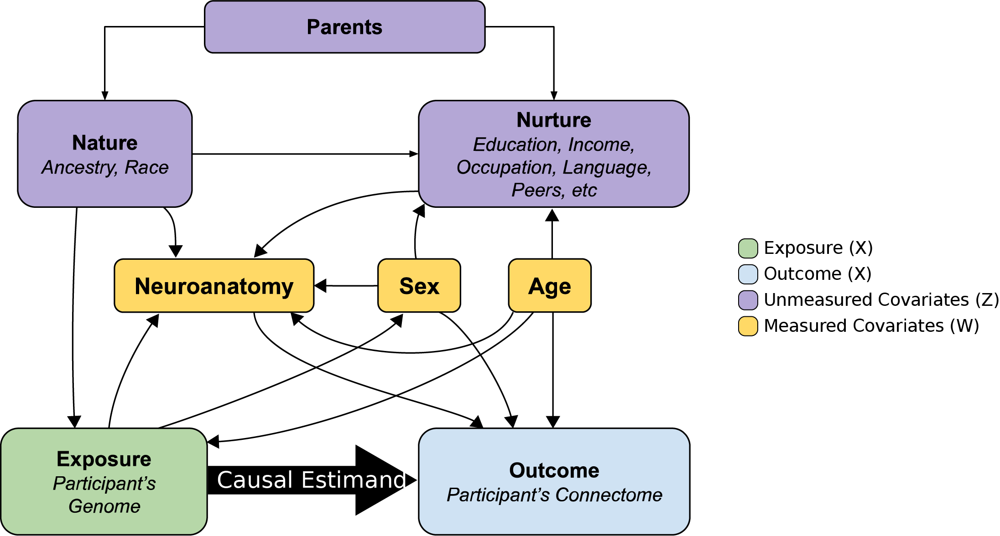
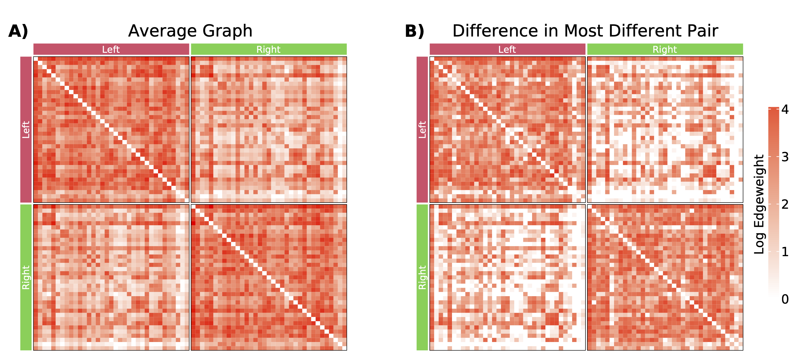
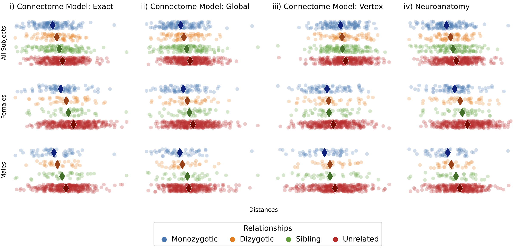
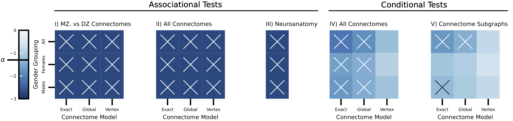

<!-- Start header -->

<!-- Image in the upper left -->

<!-- Title and author information -->

# The Heritability of Human Connectomes: a Causal Modeling Analysis

## Jaewon Chung1\*, Eric Bridgeford1, Michael Powell2, Derek Pisner 3, Joshua T. Vogelstein1

##### 1 - Johns Hopkins University, 2 - United States Military Academy, 3 - Independent Researcher, $\ast$ - correspondence:  [_j1c@jhu.edu_](mailto:j1c@jhu.edu)  [_@j1c(Github)_](https://github.com/j1c)  [_@j1chung(Twitter)_](https://twitter.com/j1chung)

<!-- Image on the upper right -->

<!--  -->

<!-- End header -->

<!-- Summary box title -->

 Summary 

<!-- Summary box using 5 columns-->

<!-- Box col1 -->

- Aimed to define heritability for populations of connectomes using statistical modelling.

- Structural connectomes are heritable without controlling for neuroanatomy.
- Neuroanatomy is also highly heritable

- Connectomes remain heritable after controlling for effects of neuroanatomy on connectomes.

- Provide tools for future analysis on populations of connectomes.

<!-- End columns-box -->

<!-- End box -->

<!-- Start main 2 column split for poster -->

<!-- Start main column 1 -->

### Motivation

- Understanding how brain connectivity is influenced by genetics can improve our understanding of brain function and diseases.
- Current methods of analyzing connectomes or hertability exhibit limitations:
  - Selection Graph theoretic features
  - Multivariate normality assumptions

### Overview of Analysis

<!-- Big question for this work -->

**Fig 1:** Overview of the framework for measuring heritability of connectomes.

 

## Do  genomes  cause connectomes?

 

### Causal Analysis of Effect of Genome on Connectomes

- Genome directly affects the structural connectome.
- Neuroanatomy (e.g. brain volume) indirectly affects the connectome.
- Participant history, such as the shared and non-shared environmental influences, and traits are potential confounders.
- The shared and non-shared environment is controlled by comparing between the same sex individuals.

**Fig 2:** Directed acyclic graph (DAG) illustrating potential relationships between the genome and connectome.

<!-- End main column 1 -->

<!-- Start main column 2 -->

### Structural Connectomes from Diffusion MRI

**Fig 3:** Visualization of connectomes as adjacency matrices using the projected Desikan parcellation with hemispheric labels. **(A)** Average connectome of all subjects with log-transformed edge weights. **(B)** Absolute difference of connectomes from the most different pair of subjects with log-transformed edge weights.

 

### New title

**Fig 3:** Visualization of pairwise distances of connectomes and neuroanatomy. Diamonds represent the median. Median distances grow as genetic distances increase.

 

### New title

**Fig 4:** Testing for associational heritability of connectomes and neuroanatomy. Red squares indicate significant tests; blue indicate non-significant tests.

<!-- End main column 2 -->

<!-- Start main column 3 -->

### Human Connectome Project 1200

- Structural connectomes are estimated using structural (sMRI) and diffusion magnetic resonance imaging (dMRI).

|            | Monozygotic  |  Dizygotic  | Non-twin siblings |
| :--------: | :----------: | :---------: | :---------------: |
|     N      |     322      |     212     |        490        |
|    Sex     | 196 F, 126 M | 125 F, 87 M |   237 F, 253 M    |
| Age (mean) |  29.6 (3.3)  | 28.9 (3.4)  |    28.3 (3.9)     |

**Table 1:** Participants and their demographics of HCP1200 Dataset.

### Three Models of Connectomes

- **Exact:** Are the model parameters of connectomes the same?
- **Global scale:** Are the model parameters same after considering global scaling?
- **Vertex scale:** Are the model parameters same after considering vertex wise scaling?

**Fig 3:** Examples of the three different models (exact, global scale, and vertex scale) of connectome heritability visualized as adjacency matrices. Networks are sampled from stochastic block models (SBMs) with different block probabilities.

 

### Limitations and extensions

- Potential confounders that are not considered.
- Other staitsical models to consider (e.g. COSIE [3]).
- Repeated analysis on functional MRI or in other twin study datasets.

<!-- Code/Refs/Thanks/Funding - small section -->

###

#### Code

<!-- Logo for a package -->

<!-- Badges for a package -->

<!-- QR code to a package -->

<!-- Logo for a package -->

**hyppo**

<!-- Badges for a package -->

<!-- QR code to a package -->

 

#### Acknowledgements

<footer>
NeuroData lab for many ideas and feedback. Many at Microsoft Research for w/ graspologic.
</footer>

#### References

<!-- Need these breaks   between refs otherwise formatting breaks for some reason -->
<footer>
[1] Chung et al. "The Heritability of Human Connectomes: a Causal Modeling Analysis," In bioRxiv (2023)
 
[2] Chung et al. "Statistical connectomics," Ann. Rev. Statistics and its Application (2021)
 
[3] Arroyo et al. "Inference for multiple heterogeneous networks with a common invariant subspace," JMLR (2021)
</footer>

#### Funding

<footer>
J.C. supported by the BRAIN Initiative (1RF1MH123233). J.T.V. supported by NSF CAREER Award (1942963). Findings and conclusions expressed are  those of the authors and not necessarily those of the funders.
</footer>

<!-- End main column 2 -->

<!-- End main columns -->

