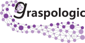

<!-- _paginate: false -->

# Statistical Connectomics

## Thesis Committee Meeting

 

### Jaewon Chung

_(he/him)_ - [NeuroData lab](https://neurodata.io/)
Johns Hopkins University
Department of Biomedical Engineering

 [_j1c@jhu.edu_](mailto:j1c@jhu.edu)
 [_@j1c (Github)_](https://github.com/j1c)
 [_@j1c (Twitter)_](https://twitter.com/j1c)

<!-- https://neurodata.io/talks/tathey1/23_06_12_thesis/pres.html#2 -->

---

# Outline

- What we've done

  - `graspologic` + `hyppo`

- Graduation plan

---

## How to use these tools?

## [graspologic](https://github.com/microsoft/graspologic)

  

  

## [hyppo](https://github.com/neurodata/hyppo)

  

---

# Outline

- What we've done

  - `graspologic` + `hyppo`

- **Graduation plan**

---

# Summary of work so far

#### Manuscripts

- (Co)-First author
  - Heritability, in review at _Imaging Neuro_ (2024)
  - Indep. Testing in Time Series, _TMLR_ (2024)
  - m2g, in review at _Nature Methods_ (2024)
  - Two-sample graph testing, _Stat_ (2022)
  - Statistical Connectomics, _ARISA_ (2021)
  - `graspologic`, _JMLR_ (2019)
- Second author
  - Causal Conditional DCorr, _in review_ (2023)
  - Multiscale Connectomics, _in review_ (2023)
- Others
  - 4 others published

#### Conference presentations

- OHBM (x3)
- SfN (x3)
- Neuromatch (x2)
- NeurIPS (x1)

#### Invited Lectures & Talks

- JSM, 2023
- Advanced Graph Analytics Workshop (JHU), 2023
- OHBM, 2019

#### Awards

- BRAIN Initiative Trainee Highlight Award
- AWS Research Credit Grants (x2)

---

# Summary of work to be done

#### Manuscripts

- Collaboration with Child Mind Institute
- Collaboration with Alex Badea

#### Code

- Continue to develop `graspologic` and `hyppo`

 
 
 

## Graduation $\approx$ May 2024

---

# Acknowledgements

#### Team

Eric Bridgeford

Ben Pedigo

Derek Pisner

Cencheng Shen

Ronak Mehta

Vivek Gopalakrishnan

Mike Powell

Carey Priebe

Joshua Vogelstein

NeuroData lab, Microsoft Research

#### Funding

NSF CAREER Award (J.T.V.), NSF NeuroNex Award (J.T.V.), NIH BRAIN Initiative (J.T.V.)

---

# Feedback?

 
 
 
 

### Jaewon Chung

 [j1c@jhu.edu](mailto:j1c@jhu.edu)
 [@j1c (Github)](https://github.com/j1c)
 [j1c.org](https://j1c.org/)
