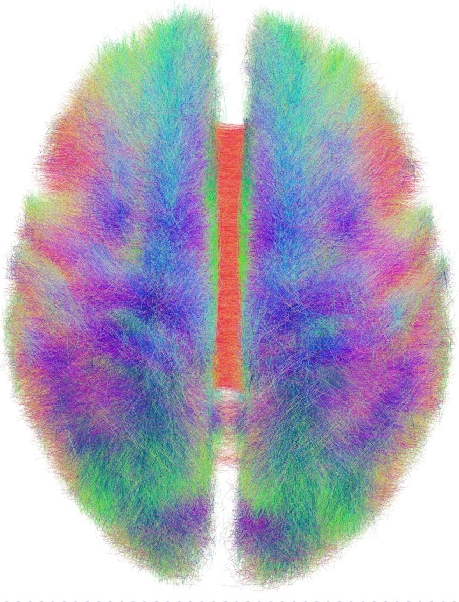

<!-- _paginate: false -->

# Statistical Connectomics

## Thesis Committee Meeting

 

### Jaewon Chung

_(he/him)_ - [NeuroData lab](https://neurodata.io/)
Johns Hopkins University
Department of Biomedical Engineering

 [_j1c@jhu.edu_](mailto:j1c@jhu.edu)
 [_@j1c (Github)_](https://github.com/j1c)
 [_@j1c (Twitter)_](https://twitter.com/j1c)

<!-- https://neurodata.io/talks/tathey1/23_06_12_thesis/pres.html#2 -->

---

# Outline

- What we've done

  - **Deriving Connectomes of Human Brains**
  - Statistical Modeling for Connectomes
  - Heritability of Human Connectomes
  - `graspologic` + `hyppo` + `m2g`

- Graduation plan

---

# Representing brains as networks

Networks (or graphs) are mathematical abstractions to represent relational data

- **Vertices** - the set of objects (brain regions)
- **Edges** - the set of connections between those objects (brain regions)
  - E.g. region 1 connects to region 2 with 100 neural bundles

---

# Connectomes from diffusion MRI (dMRI)

- _in vivo_ imaging technique
- Exploits direction of water diffusion
  - Anisotropic in white matter tracts
  - Isotropic in other tissues
- Estimates of number of white matter tracts

---

# MRI to graphs (m2g)

- Easy to use end-to-end pipeline
  - Input: MRI data
  - Output: Connectomes, QA measures, derivatives
- Biological properties
  - Stronger ipsilateral connections
- High discriminability
  - Same subjects' connectomes are more similar than different subjects'

<!--  -->

<footer>

[Chung et al. "A low-resource reliable pipeline to democratize multi-modal connectome estimation and analysis." <i>In review, Nature Methods</i> (2024)](https://www.biorxiv.org/content/10.1101/2021.11.01.466686v2)

</footer>

---

# Outline

- What we've done

  - Connectomes of Human Brains
  - **Statistical Modeling for Connectomes**
  - Heritability of Human Connectomes
  - `graspologic` + `hyppo` + `m2g`

- Graduation plan

---

# Different networks, same statistics

- These four networks have same (graph) statistics!

 
 

<footer>

[Chung et al. "Statistical connectomics." <i>Annual Review of Statistics and Its Application</i> (2021)](https://www.annualreviews.org/content/journals/10.1146/annurev-statistics-042720-023234)

</footer>

---

# Statistical Models for Networks

- Random dot product graphs (RDPGs)
  - Each vertex has a low $d$ dimensional latent vector.
  - Estimate latent position matrix $X$ via adjacency spectral embedding.
  - $P[i\rightarrow j]$ = $\langle x_i, x_j\rangle$

 

---

# Testing

---

---

# Outline

- What we've done

  - Connectomes of Human Brains
  - Statistical Modeling for Connectomes
  - **Heritability of Human Connectomes**
  - `graspologic` + `hyppo` + `m2g`

- Graduation plan

---

# Heritability as causal problem

<footer>

[Chung et al. "Are human connectomes heritable?" <i>In prep, Imaging Neuroscience</i> (2024)](https://www.biorxiv.org/content/10.1101/2023.04.02.532875v3)

</footer>

---

# Do genomes affect connectomes?

- Our hypothesis:
  $H_0: F($Connectome|Genome$) = F($Connectome$)$
  $H_A: F($Connectome|Genome$) \neq F($Connectome$)$

- Alternatively:
  $H_0: F($Connectome, Genome$) = F($Connectome$)F($Genome$)$
  $H_A: F($Connectome, Genome$) \neq F($Connectome$)F($Genome$)$

- Known as independence testing
- Test statistic: _distance correlation (dcorr)_
- Implication if false: there exists an associational heritability.

---

# How do we compare connectomes?

- Random dot product graph (RDPG)

  - Each vertex (region of interest) has a low $d$ dimensional latent vector (position).
  - Estimate latent position matrix $X$ via adjacency spectral embedding.
  <!-- - $P[i\rightarrow j]$ = $\langle x_i, x_j\rangle$ -->

- d(Connectome$_k$, Connectome$_l$) = $||X^{(k)} - X^{(l)}R||_F$

---

# Distance correlation

- Measures dependence between two _multivariate_ quantities.
  - For example: connectomes, genomes.
- Can detect nonlinear associations.
- Measures correlation between pairwise distances.

---

# Do genomes affect connectomes given covariates?

- Want to test:
  $H_0: F($Conn., Genome|Covariates$) = F($Conn.|Covariates$)F($Genome|Covariates$)$
  $H_A: F($Conn., Genome|Covariates$) \neq F($Conn.|Covariates$)F($Genome|Covariates$)$
- Known as conditional independence test
- Test statistic: Conditional distance correlation (cdcorr)
- Implication if false: there exists causal dependence of connectomes on genomes.

---

# Conditional distance correlation

- Augment distance correlation procedure with third distance matrix.

 

---

# How do we compare genomes?

- Neuroimaging twin studies do not sequence genomes.
- Coefficient of kinship ($\phi_{ij}$)
  - Probabilities of finding a particular gene at a particular location.
- d(Genome$_i$, Genome$_j$) = 1 - 2$\phi_{ij}$.

 

|   Relationship    |  $\phi_{ij}$  | $1-2\phi_{ij}$ |
| :---------------: | :-----------: | :------------: |
|    Monozygotic    | $\frac{1}{2}$ |      $0$       |
|     Dizygotic     | $\frac{1}{4}$ | $\frac{1}{2}$  |
| Non-twin siblings | $\frac{1}{4}$ | $\frac{1}{2}$  |
|     Unrelated     |      $0$      |      $1$       |

---

# Neuroanatomy (mediator), Age (confounder)

- Literature show:
  - neuroanatomy (e.g. brain volume) is highly heritable.
  - age affects genomes and potentially connectomes
- d(Covariates$_i$, Covariates$_j$) = ||Covariates$_i$ - Covariates$_j$||$_F$

---

# Human Connectome Project

- Brain scans from identical (monozygotic), fraternal (dizygotic), non-twin siblings.
- Regions defined using Glasser parcellation (180 regions).

 

<footer>
Van Essen, David C., et al., The WU-Minn human connectome project: an overview (2013)

Glasser, Matthew F., et al. "A multi-modal parcellation of human cerebral cortex." Nature (2016).

</footer>

---

# Associational Test for Connectomic Heritability

- $H_0: F($Connectome, Genome$) = F($Connectome$)F($Genome$)$
  $H_A: F($Connectome, Genome$) \neq F($Connectome$)F($Genome$)$

 

|   Sex   |      **All**      |    **Females**    |     **Males**     |
| :-----: | :---------------: | :---------------: | :---------------: |
| p-value | $<1\times10^{-5}$ | $<1\times10^{-3}$ | $<1\times10^{-2}$ |

---

# Associational Test for Neuroanatomy

- $H_0: F($Neuroanatomy, Genome$) = F($Neuroanatomy$)F($Genome$)$
  $H_A: F($Neuroanatomy, Genome$) \neq F($Neuroanatomy$)F($Genome$)$

 

|   Sex   |      **All**      |    **Females**    |     **Males**     |
| :-----: | :---------------: | :---------------: | :---------------: |
| p-value | $<1\times10^{-3}$ | $<1\times10^{-2}$ | $<1\times10^{-2}$ |

---

# Causal Test for Connectomic Heritability

- $H_0: F($Conn., Genome|Covariates$) = F($Conn.|Covariates$)F($Genome|Covariates$)$
  $H_A: F($Conn., Genome|Covariates$) \neq F($Conn.|Covariates$)F($Genome|Covariates$)$

 

|   Sex   |      **All**      |    **Females**    |     **Males**     |
| :-----: | :---------------: | :---------------: | :---------------: |
| p-value | $<1\times10^{-2}$ | $<1\times10^{-2}$ | $<1\times10^{-2}$ |

---

# To sum up...

- Present a causal model for heritability of connectomes.
- Leveraged recent advances:
  1. Statistical models for networks, allowing meaningful comparison of connectomes.
  2. Distance and conditional distance correlation as test statistic for causal analysis$^1$.
- Connectomes are dependent on genome, suggesting heritability.

---

# Outline

- What we've done

  - Connectomes of Human Brains
  - Statistical Modeling for Connectomes
  - Heritability of Human Connectomes
  - **`graspologic` + `hyppo` + `m2g`**

- Graduation plan

---

## How to use these tools?

## [graspologic](https://github.com/microsoft/graspologic)

  

## [hyppo](https://github.com/neurodata/hyppo)

## [m2g](https://github.com/neurodata/m2g)

---

# Outline

- What we've done

  - Connectomes of Human Brains
  - Statistical Modeling for Connectomes
  - Heritability of Human Connectomes
  - `graspologic` + `hyppo`

- **Graduation plan**

---

# Summary of work so far

#### Manuscripts

- (Co)-First author
  - Heritability, in review at _Imaging Neuro_ (2024)
  - m2g, in review at _Nature Methods_ (2024)
  - Two-sample graph testing, _Stat_ (2022)
  - Statistical Connectomics, _ARISA_ (2021)
  - `graspologic`, _JMLR_ (2019)
- Second author
  - Indep. Testing in Time Series, _TMLR_ (2024)
  - Causal Conditional DCorr, _in review_ (2023)
  - Multiscale Connectomics, _in review_ (2023)
- Others
  - 5 others published

#### Conference Presentations

- OHBM (x3)
- SfN (x3)
- Neuromatch (x2)
<!-- - NeurIPS Workshop (x1) -->

#### Invited Lectures & Talks

- JSM, 2023
- Advanced Graph Analytics Workshop (JHU), 2023
- OHBM, 2019

#### Awards

- BRAIN Initiative Trainee Highlight Award
- AWS Research Credit Grants (x2)

---

# Summary of work to be done

#### Manuscripts

- Respond to reviews
- Collaboration with Child Mind Institute
<!-- - Collaboration with Alex Badea -->

#### Conferences/Talks

- Collaborative Research in Computational Neuroscience (CRCNS)
- Advanced Graph Analytics Workshop (JHU), 2024

#### Code

- Continue to develop `graspologic` and `hyppo`

 

## Graduation $\approx$ May 2024

---

# Acknowledgements

#### Team

Eric Bridgeford

Ben Pedigo

Derek Pisner

Cencheng Shen

Ronak Mehta

Vivek Gopalakrishnan

Mike Powell

Carey Priebe

Joshua Vogelstein

NeuroData lab, Microsoft Research

---

# Feedback?

 
 
 
 

### Jaewon Chung

 [j1c@jhu.edu](mailto:j1c@jhu.edu)
 [@j1c (Github)](https://github.com/j1c)
 [j1c.org](https://j1c.org/)
