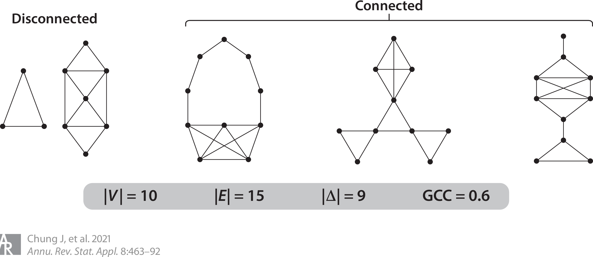

<!-- _paginate: false -->

# CZ Biohub Network

 

### Jaewon Chung

_(he/him)_ - [NeuroData lab](https://neurodata.io/)
Johns Hopkins University
Department of Biomedical Engineering

 [_j1c@jhu.edu_](mailto:j1c@jhu.edu)
 [_@j1c (Github)_](https://github.com/j1c)
 [_@j1c (Twitter)_](https://twitter.com/j1c)

---

# Overview

- M.S. and Ph.D. in Biomedical Engineering @ Johns Hopkins University
- Focus:
    1. developing statistical methods
        - for network data, specifically brain networks
        - for time-series data
        - for causal inference in observational studies
    2. developing open-source software

---

# Connectomes: maps of neural wiring

- Brains contain **neurons**, which carry information via electrical signals
- Neurons **connect** to each other via synapses, allowing neurons to "talk" to each other
- **Connectome** is a map of the structure of neurons and the connections between them
    - Shaped by evolution, experience, influences neural activity, behavior

<footer>

Pedigo et al.

</footer>

---

# How do we measure connectomes in humans?

- Diffusion MRI (dMRI): _in vivo_ imaging technique
- Exploits direction of water diffusion
  - Anisotropic in white matter tracts
  - Isotropic in other tissues

---

 
 
 

### MRI Scans

 

### Preprocessing

### Tractography

---

# Representing brains as networks

Networks (or graphs) are mathematical abstractions to represent relational data

- **Vertices** - the set of objects (brain regions)
- **Edges** - the set of connections between those objects (brain regions)
  - E.g. region 1 connects to region 2 with 100 neural bundles

---

# MRI to graphs (m2g)

- Easy to use end-to-end pipeline
  - Input: MRI data
  - Output: Connectomes, QA measures, derivatives
- Reproduces biological properties
  - Stronger ipsilateral connections
- High discriminability
  - Same subjects' connectomes are more similar than different subjects'

<!--  -->

<footer>

[Chung et al. "A low-resource reliable pipeline..." <i>In review, Nature Methods</i> (2024)](https://www.biorxiv.org/content/10.1101/2021.11.01.466686v2)

</footer>

---

# Statistical models for networks

- Random dot product graphs (RDPGs)
  - Each vertex has a low $d$ dimensional latent position.
  - Estimate latent position matrix $X$ via adjacency spectral embedding.
  - $P[i\rightarrow j]$ = $\langle x_i, x_j\rangle$

<footer>

[Athreya et al. "RDPG..." _JMLR_ (2021)](https://jmlr.org/papers/v18/17-448.html)

</footer>

---

# Two sample graph testing

- Suppose we have two networks
- Want to test if they are "same" or not

Hypothesis:

- $H_0: F($Network 1$) = F($Network 2$)$
- $H_A: F($Network 1$) \neq F($Network 2$)$

More precisely:

- $H_0: F_X = F_Y \circ W$
- $H_A: F_X \neq F_Y \circ W$

###### Drosophila Left vs Right Brain

<footer>

[Chung et al. "Valid two-sample graph testing..." <i>Stat</i> (2022)](https://doi.org/10.1002/sta4.429)

</footer>

---

# Connectomic heritability

 

<footer>

[Chung, Jaewon, et al. "Are human connectomes heritable?" <i>In review, Imaging Neuroscience</i> (2024)](https://www.biorxiv.org/content/10.1101/2023.04.02.532875.abstract)

</footer>

---

  

<footer>

[Chung, Jaewon, et al. "Are human connectomes heritable?" <i>In review, Imaging Neuroscience</i> (2024)](https://www.biorxiv.org/content/10.1101/2023.04.02.532875.abstract)

</footer>

---

# Other works

1.  Independence Testing in Multivariate Time-series data
    - Let $(X_t, Y_t) \sim F_{XY}, \ t \in [n] = \{1, 2, \ldots, n\}$
    - Maximum lag $M$.

$$
\begin{aligned}
H_0: &\ F_{X_t, Y_{t-j}} = F_{X_t}F_{Y_{t-j}} \ \text{for each $j\in\{0, 1, \ldots, M\}$} \\
H_A: &\ F_{X_t, Y_{t-j}} \neq F_{X_t}F_{Y_{t-j}} \ \text{for some $j\in\{0, 1, \ldots, M\}$}
\end{aligned}
$$

2. Hypothesis Testing for Causal Effects

$$
\begin{align}
    H_0 : F_{\mathbf y_i, \mathbf v_i|\mathbf x_i} = F_{\mathbf y_i|\mathbf x_i}F_{\mathbf v_i|\mathbf x_i} \\
    H_A : F_{\mathbf y_i, \mathbf v_i|\mathbf x_i} \neq F_{\mathbf y_i|\mathbf x_i}F_{\mathbf v_i|\mathbf x_i}
\end{align}
$$

<footer>

[Shen, Cencheng, et al. "Independence Testing for Temporal Data" <i>TMLR</i> (2024)](https://openreview.net/forum?id=jv1aPQINc4)
[Bridgeford, Eric, et al. "Learning sources of variability from high-dimensional observational studies" <i>In review, Biometrika (2024)</i>](https://arxiv.org/pdf/2307.13868)

</footer>

---

# Open-source software

## [graspologic](https://github.com/microsoft/graspologic)

  

## [hyppo](https://github.com/neurodata/hyppo)

## [m2g](https://github.com/neurodata/m2g)

<!--  -->

---

<!-- paginate: skip -->

     

<h1 align="center">Additional Slides

---

# Different data, same statistics (Ascombe's Quartet)

- These four datasets have same statistics!
    - Mean ($\bar x$): 9
    - Variance ($s^2_x$): 11
    - Mean ($\bar y$): 7.5
    - Variance ($s^2_y$): 4.12
    - Correlation ($\rho_{xy}$):0.816

 

<footer>

[Wikipedia - Ascombe's Quartet](https://en.wikipedia.org/wiki/Anscombe's_quartet)

</footer>

---

# Different networks, same statistics

- These four networks have same (network) statistics!

 

<footer>

[Chung et al. "Statistical connectomics." <i>Annual Review of Statistics and Its Application</i> (2021)](https://www.annualreviews.org/content/journals/10.1146/annurev-statistics-042720-023234)

</footer>

---

# Show the other figure of the same statistics

- Consider all non-isomorphic graphs with 10 vertices

<footer>

[Chung et al. "Statistical connectomics." <i>Annual Review of Statistics and Its Application</i> (2021)](https://www.annualreviews.org/content/journals/10.1146/annurev-statistics-042720-023234)

</footer>

---

# Analysis Framework

---

# Causal Directed Acyclic Graph

 

---

# Causal Estimand

- $X$ denote exposure, $Y$ denote outcome, $W$ denote measured covariates, $Z$ denote unmeasured covariates.
- Want to estimate the effect of different exposures on the outcome, which is quantified using the backdoor formula if $W$ and $Z$ close all backdoor paths.
  $$f_{w, z}(y|x) = \int_{\mathcal{W}\times\mathcal{Z}}f(y|x, w, z)f(w, z)\mathrm{d}(w, z) $$

- Above integrates over _all_ measured and unmeasured covariates.

$$ f(y | x) = \int\_{\mathcal W \times \mathcal Z}{f(y | x, w, z) f(w, z | x)}{(w, z)} $$

- Averages the true outcome distribution over the _conditional_ distribution of the measured and unmeasured covariates.

---

# Hypothesis Testing

### Associational Heritability

- We observe the pairs $(x_i, y_i)$ for $i\in[n]$.
- Only be able to estimate the functions of $(X, Y)$
- The corresponding hypothesis test is:
  $$
  H_0: f(y|x) = f(y) \quad \text{vs} \quad
  	H_A: f(y|x) \neq f(y).
  $$

### Causal Heritability

- We observe the triples $(x_i, y_i, w_i)$ for $i\in[n]$.
- Only be able to estimate the functions of $(X, Y, W)$
- The corresponding hypothesis test is:
  $$
  H_0: f(y|x, w) = f(y|w) \quad \text{vs} \quad
  	H_A: f(y|x, w) \neq f(y|w).
  $$

---

# Connectome Models

-**Exact model**: This model measures all differences between latent positions, with differences in the latent positions implying differences in the connectomes themselves.

-**Global model**: This model examines whether the latent positions of one connectome are a scaled version of the other. For example, if the number of edges in male connectomes are consistently larger than those in females, we have no way of differentiating whether significant findings from the exact model are a result of differences in scaling or differences in the fundamental structure of the connectomes themselves.

-**Vertex model**: This model is similar to the global model, but it allows for each vertex to be scaled differently. The idea behind this approach is that some vertices may have a greater impact on the overall network than others, so scaling them differently can provide a more accurate representation of the network. Consider the examples of how brain regions connect with each other. Regions in the same hemisphere are more likely to be connected than across hemispheres. Even within the same hemisphere, different regions may have distinct preferences for forming connections with other specific regions.

---

# Connectome Model Simulations

# Shortcomings - Network model

- Problems with connectome estimation.
  - Inability to determine the precise origin/termination of connections in the cortex.
    - -> false negatives
  - Crossing fibers
    - -> false positives
- RDPG can only represent subset of independent edge networks.

---

# Shortcomings - Model assumptions

- No interaction between genome and environment
- No epistatsis
  - Effect of one gene is dependent on another
  - Ex: black hair and baldness
- No dominance effects
- Strong assumptions in genetic distances
