<!-- _paginate: false -->

# Statistical Connectomics: Developing Methods Towards Understanding Populations of Networks

 

### Jaewon Chung

_(he/him)_ - [NeuroData lab](https://neurodata.io/)
Johns Hopkins University
Department of Biomedical Engineering

 [_j1c@jhu.edu_](mailto:j1c@jhu.edu)
 [_@j1c (Github)_](https://github.com/j1c)
 [_@j1c (Twitter)_](https://twitter.com/j1c)

---

<!-- before i get into the bulk of the talk, i want to steal a page from previous lab members, and start my defense with the acknowledgements. That way if you glaze over or fall asleep later in the talk, I hope you'll remember the important part, which is my graditute to the people which I should probably express more often. -->

# Acknowledgements

---

<!-- First, to my advisor, my committee, and close collaborators. I will be forever humbled that you all trusted me to work on data and problems that you all have spent so much time and energy on. I'm grateful for that opportunity and for all I've learned from you over the years, and I'm confident that we'll keep working together for a long while... -->

# Committee

Joshua Vogelstein

Carey Priebe

Mike Powell

## Collaborators

Alex B.

Eric B.

Derek P.

Cencheng S.

Ronak M.

---

<!-- I want to thank many current and past members of the neurodata lab and hopkins. It has been a great honor to get to learn from you all on a daily basis, and not just about machine learning or neuroscience or statistics, but also frisbee -->

Alex

<!-- Loftus -->

Ali

<!-- Saad-Eldin -->

Alice

<!-- Wang -->

Anton

<!-- ... -->

Ashwin

<!-- ... -->

Bear

<!-- ... -->

Ben 1

<!-- Falk -->

Ben 2

<!-- ... -->

Bijan

<!-- ... -->

Brandon

<!-- ... -->

Devin

<!-- Crowley -->

Drishti

Eric

<!-- Bridgeford -->

Hao

Hayden

<!-- Helm -->

Javier

<!-- How -->

Jayanta

<!-- Dey -->

Jesus

<!-- Arroyo -->

Jong

<!-- Shin -->

Kareef

<!-- Ullah -->

Jesse

<!-- Patsolic -->

Ronak

<!-- Mehta -->

Ronan

<!-- Perry -->

Ross

<!-- Lawrence -->

Sambit

<!-- Panda -->

Suki

<!-- Panda -->

Tingshan

Tyler

Tommy

Vikram

Vivek

Yuxin

<!-- Bai -->

Ziyan

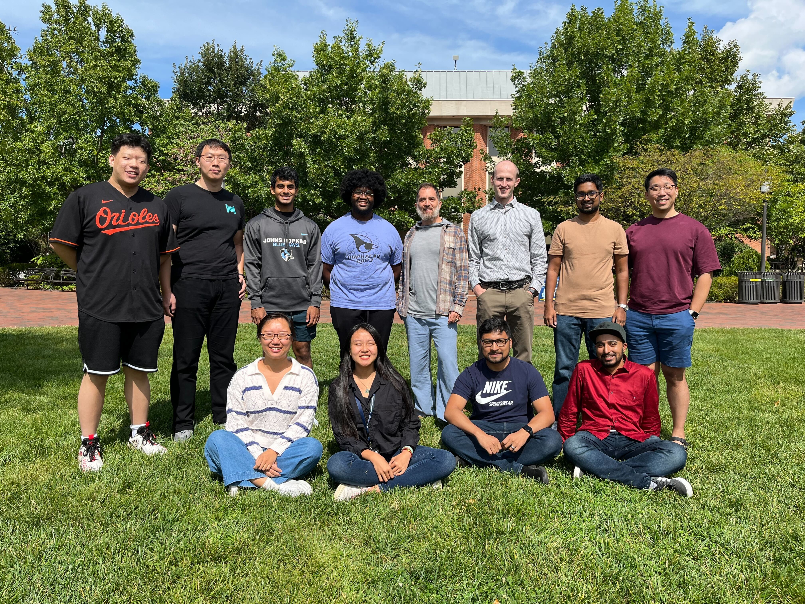

---

<!-- To my parents and my brother - I obviously owe them everything that got me to this point. Their unwavering support, encouragement, and love have been the foundation of my journey. -->

---

<!-- To my partner Lina. Im so grateful for the support and that we've made it through this chapter and with so many great memories from traveling many parts of the world. i cant wait to see what the future holds for us in the future. -->

---

# Outline

- **Connectomes of Human Brains**
- Statistical Modeling for Connectomes
- Heritability of Human Connectomes
- Open-source Software

---

# Connectomes: maps of neural wiring

- Brains contain **neurons**, which carry information via electrical signals
- Neurons **connect** to each other via synapses, allowing neurons to "talk" to each other
- **Connectome** is a map of the structure of neurons and the connections between them
    - Shaped by evolution, experience, influences neural activity, behavior

<footer>

Pedigo et al.

</footer>

---

# How do we measure connectomes in humans?

- Diffusion MRI (dMRI): _in vivo_ imaging technique
- Exploits direction of water diffusion
  - Anisotropic in white matter tracts
  - Isotropic in other tissues

---

 
 
 

### MRI Scans

 

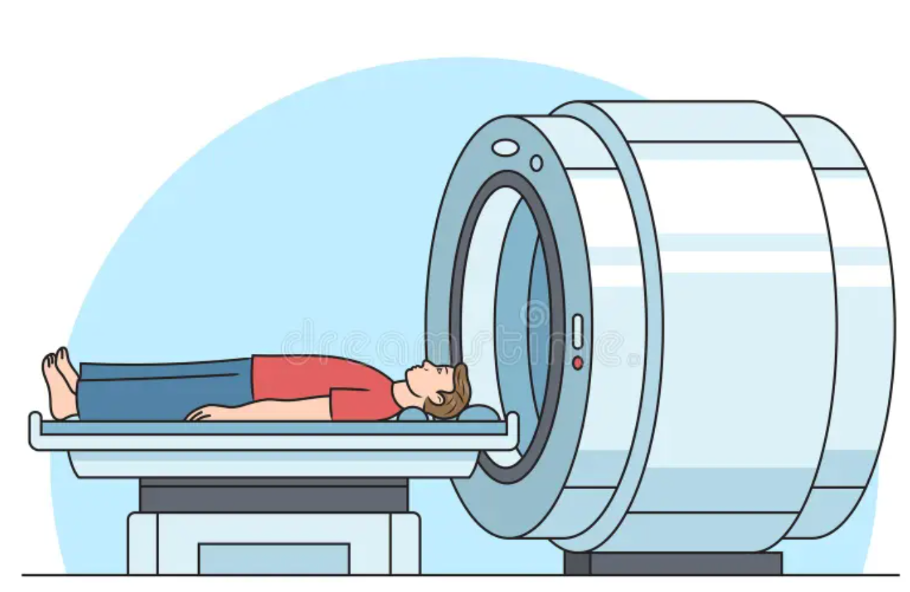

### Preprocessing

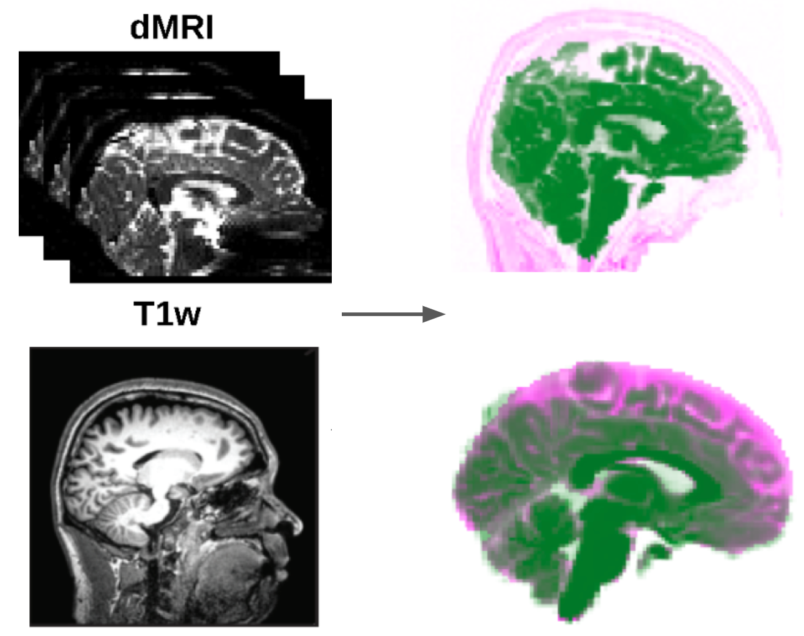

### Tractography

---

# Representing brains as networks

Networks (or graphs) are mathematical abstractions to represent relational data

- **Vertices** - the set of objects (brain regions)
- **Edges** - the set of connections between those objects (brain regions)
  - E.g. region 1 connects to region 2 with 100 neural bundles

---

# MRI to graphs (m2g)

- Easy to use end-to-end pipeline
  - Input: MRI data
  - Output: Connectomes, QA measures, derivatives
- Reproduces biological properties
  - Stronger ipsilateral connections
- High discriminability
  - Same subjects' connectomes are more similar than different subjects'

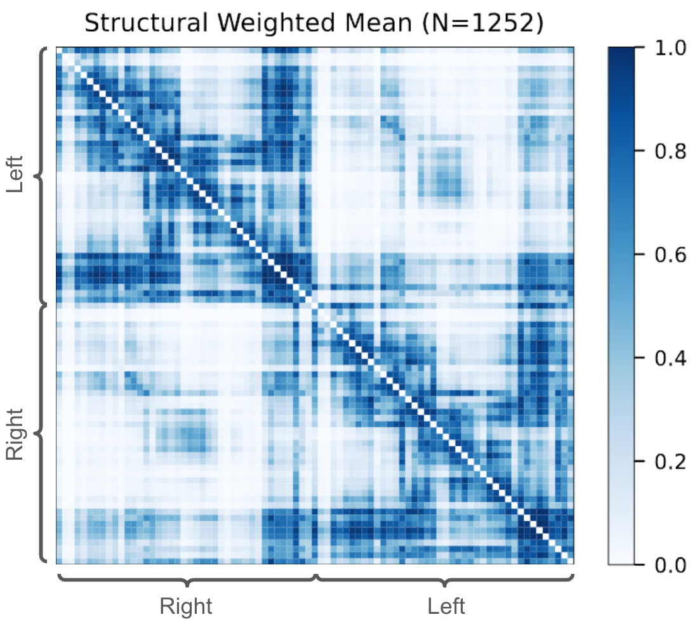

<!--  -->

<footer>

[Chung et al. "A low-resource reliable pipeline..." <i>In review, Nature Methods</i> (2024)](https://www.biorxiv.org/content/10.1101/2021.11.01.466686v2)

</footer>

---

# Connectomes: maps of neural wiring

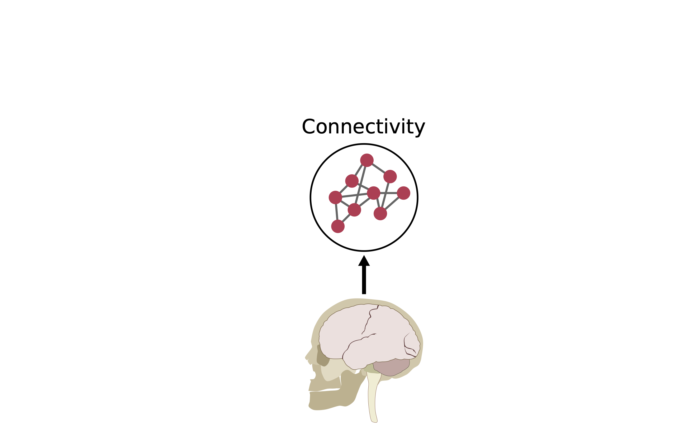

<footer>
Images from SciDraw
</footer>

---

# Linking connectivity to other phenotypes

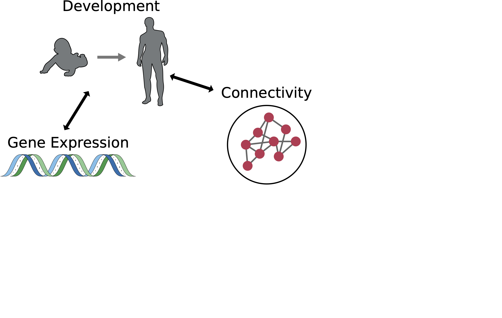

<footer>
Images from SciDraw
</footer>

---

# Linking connectivity to other phenotypes

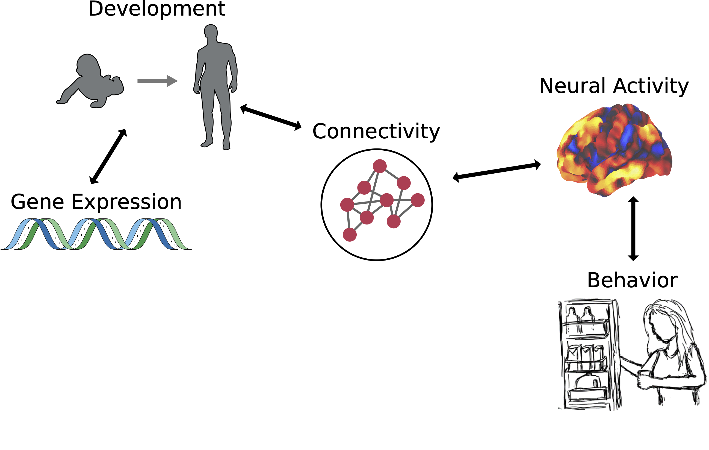

<footer>
Images from SciDraw
</footer>

---

<!-- Brain diseases disrupt communication between brain regions. This is why studying connectivity can help us develop targeted therapies for diseases like Alzheimer's and Parkinson's. -->

# Linking connectivity to other phenotypes

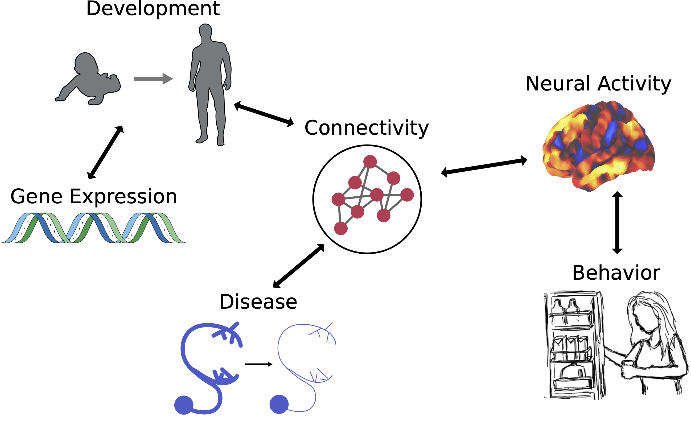

<footer>
Images from SciDraw
</footer>

---

# Outline

- Connectomes of Human Brains
- **Statistical Modeling for Connectomes**
- Heritability of Human Connectomes
- Open-source Software

---

# Different data, same statistics (Ascombe's Quartet)

- These four datasets have same statistics!
    - Mean ($\bar x$): 9
    - Variance ($s^2_x$): 11
    - Mean ($\bar y$): 7.5
    - Variance ($s^2_y$): 4.12
    - Correlation ($\rho_{xy}$):0.816

 

<footer>

[Wikipedia - Ascombe's Quartet](https://en.wikipedia.org/wiki/Anscombe's_quartet)

</footer>

---

# Different networks, same statistics

- These four networks have same (network) statistics!

 

<footer>

[Chung et al. "Statistical connectomics." <i>Annual Review of Statistics and Its Application</i> (2021)](https://www.annualreviews.org/content/journals/10.1146/annurev-statistics-042720-023234)

</footer>

---

# Show the other figure of the same statistics

- Consider all non-isomorphic graphs with 10 vertices

<footer>

[Chung et al. "Statistical connectomics." <i>Annual Review of Statistics and Its Application</i> (2021)](https://www.annualreviews.org/content/journals/10.1146/annurev-statistics-042720-023234)

</footer>

---

# Statistical models for networks

- Random dot product graphs (RDPGs)
  - Each vertex has a low $d$ dimensional latent position.
  - Estimate latent position matrix $X$ via adjacency spectral embedding.
  - $P[i\rightarrow j]$ = $\langle x_i, x_j\rangle$

<!--
<footer>

Athreya et al. "RDPG..." _JMLR_ (2021)

</footer> -->

---

# Two sample graph testing

- Suppose we have two networks
- Want to test if they are "same" or not

Hypothesis:

- $H_0: F($Network 1$) = F($Network 2$)$
- $H_A: F($Network 1$) \neq F($Network 2$)$

More precisely:

- $H_0: F_X = F_Y \circ W$
- $H_A: F_X \neq F_Y \circ W$

###### Drosophila Left vs Right Brain

<footer>

[Chung et al. "Valid two-sample graph testing..." <i>Stat</i> (2022)](https://doi.org/10.1002/sta4.429)

</footer>

---

# Outline

- Connectomes of Human Brains
- Statistical Modeling for Connectomes
- **Heritability of Human Connectomes**
- Open-source Software

---

# Heritability?

- Proportion of phenotypic variance due to genetic variance
  - Predict disease risk
  - Potential for targeted treatments

- **Do genomes cause connectomes?**

 
 

---

# Human Connectome Project

- Brain scans from identical (monozygotic), fraternal (dizygotic), non-twin siblings.
- Regions defined using Glasser parcellation (180 regions).

 

<footer>
Van Essen, David C., et al., The WU-Minn human connectome project: an overview (2013)

Glasser, Matthew F., et al. "A multi-modal parcellation of human cerebral cortex." Nature (2016).

</footer>

---

# Heritability as causal problem

<footer>

[Chung et al. "Are human connectomes heritable?" <i>In prep, Imaging Neuroscience</i> (2024)](https://www.biorxiv.org/content/10.1101/2023.04.02.532875v3)

</footer>

---

# Methods of comparing connectomes

- Exact : measures all differences in latent positions
  - Differences in the latent positions implying differences in the connectomes themselves
- Global : considers the latent positions of one connectome are a scaled version of the other
  - E.g. males may have globally fewer connections than females
- Vertex : similar to the global differences, but it allows for each vertex to be scaled differently
  - E.g regions have preferences in connections
  - regions tend to connect strongly within hemisphere

---

# Distribution of distances between connectomes

- Stochastic ordering along familial relationships
- Monozygotic twins have the smallest distances
- Medians (diamonds) shift towards the right as relatedness decreases
- Shifts in medians "decrease" in vertex model

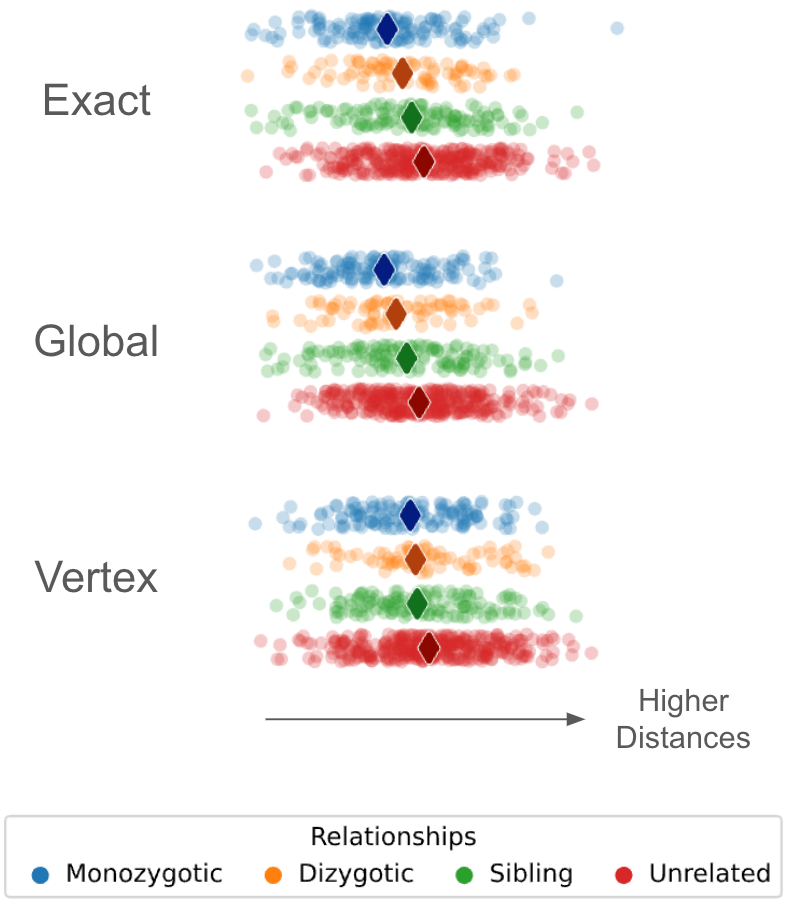

<!--  -->

---

# Do genomes affect connectomes?

- Our hypothesis:
  $H_0: F($C, G$) = F($C$)F($G$)$
  $H_A: F($C, G$) \neq F($C$)F($G$)$

- Known as independence testing
- Test statistic: _distance correlation (Dcorr)_
- p-value: "If genomes don't affect connectomes, what is the probability there is **associational** correlation?"

 
 

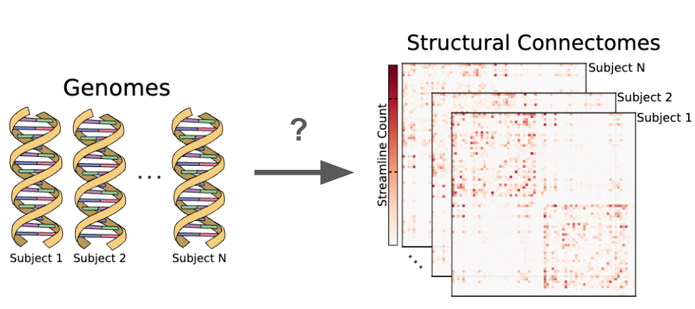

---

# Genomes affect connectomes

- Our hypothesis:
  $H_0: F($C, G$) = F($C$)F($G$)$
  $H_A: F($C, G$) \neq F($C$)F($G$)$

- p-value: "If genomes don't affect connectomes, what is the probability there is **associational** correlation?"
- All p-values $<10^{-3}$

 

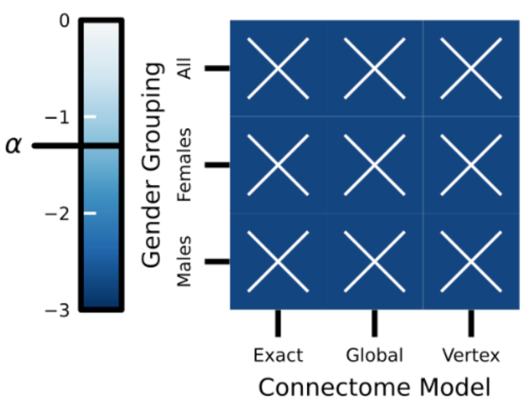

---

# Do genomes affect connectomes given covariates?

- Want to test:
  $H_0: F($C, G|Co$) =
  F($C|Co$) F($G|Co$)$
  $H_A: F($C, G|Co$) \neq F($C|Co$)F($G|Co$)$
- Known as conditional independence test
- Test statistic: Conditional distance correlation (CDcorr)
- p-value: "If genomes don't affect connectomes, what is the probability there is **causal** correlation?"

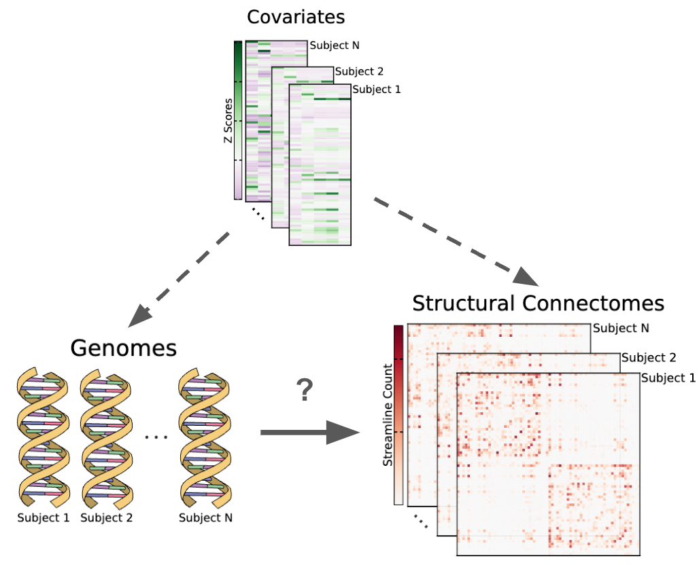

---

# Genomes affect connectomes given covariates

- Want to test:
  $H_0: F($C, G|Co$) =
  F($C|Co$) F($G|Co$)$
  $H_A: F($C, G|Co$) \neq F($C|Co$)F($G|Co$)$
- p-value: "If genomes don't affect connectomes, what is the probability there is **causal** correlation?"
- p-values $<10^{-2}$ for only exact and global models

 
 

---

# What if we remove "heritable" vertices?

- Test per vertex $i$:
$H_0: F($$C_i$, G|Co$) =
  F($$C_i$|Co$) F($G|Co$)$
$H_A: F($$C_i$, G|Co$) \neq F($$C_i$|Co$)F($G|Co$)$

- Then test "non-heritable" subgraphs ($C_s$):
$H_0: F($$C_s$, G|Co$) =
  F($$C_s$|Co$) F($G|Co$)$
$H_A: F($$C_s$, G|Co$) \neq F($$C_s$|Co$)F($G|Co$)$

- p-value: "If genomes don't affect connectome subgraphs, what is the probability there is **causal** correlation?"
- p-values $<10^{-2}$ for 3 hypotheses

 
 

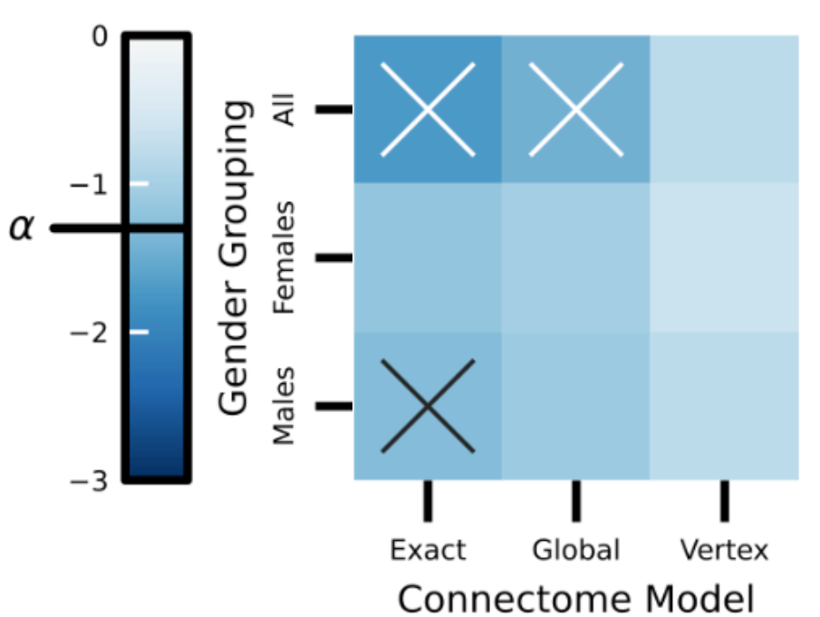

---

# To sum up...
> Are human connectomes heritable?

> Depends on the context.

- Connectomes are heritable, up to some common structures.

---

# Outline

- Connectomes of Human Brains
- Statistical Modeling for Connectomes
- Heritability of Human Connectomes
- **Open-source Software**

---

## How to use these tools?

## [graspologic](https://github.com/microsoft/graspologic)

  

## [hyppo](https://github.com/neurodata/hyppo)

## [m2g](https://github.com/neurodata/m2g)

<!-- 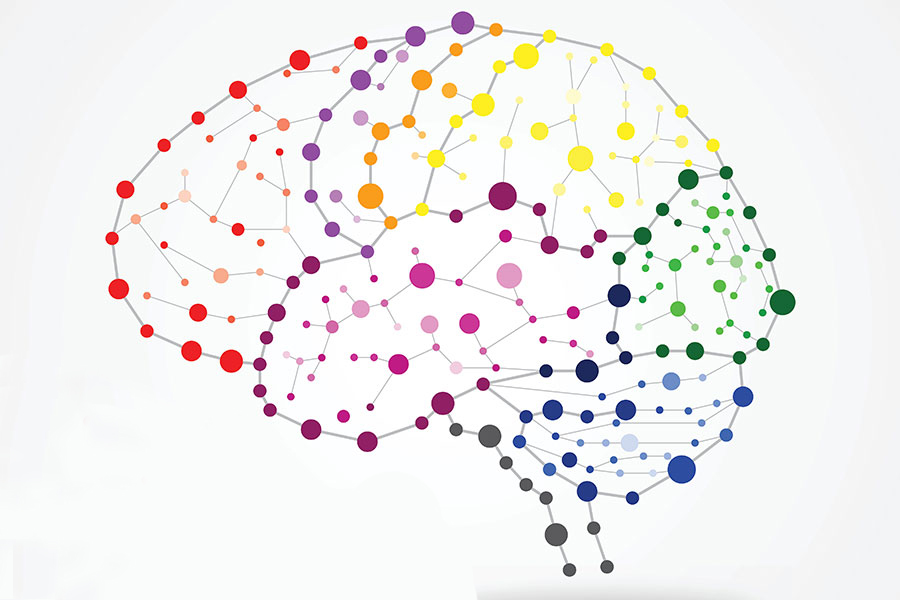 -->

---

# Questions?

 
 
 
 

### Jaewon Chung

 [j1c@jhu.edu](mailto:j1c@jhu.edu)
 [@j1c (Github)](https://github.com/j1c)
 [j1c.org](https://j1c.org/)

---

<!-- paginate: skip -->

# Appendix

---

# How do we compare genomes?

- Neuroimaging twin studies do not sequence genomes.
- Coefficient of kinship ($\phi_{ij}$)
  - Probabilities of finding a particular gene at a particular location.
- d(Genome$_i$, Genome$_j$) = 1 - 2$\phi_{ij}$.

 

|   Relationship    |  $\phi_{ij}$  | $1-2\phi_{ij}$ |
| :---------------: | :-----------: | :------------: |
|    Monozygotic    | $\frac{1}{2}$ |      $0$       |
|     Dizygotic     | $\frac{1}{4}$ | $\frac{1}{2}$  |
| Non-twin siblings | $\frac{1}{4}$ | $\frac{1}{2}$  |
|     Unrelated     |      $0$      |      $1$       |

---

# Neuroanatomy (mediator), Age (confounder)

- Literature show:
  - neuroanatomy (e.g. brain volume) is highly heritable.
  - age affects genomes and potentially connectomes
- d(Covariates$_i$, Covariates$_j$) = ||Covariates$_i$ - Covariates$_j$||$_F$

---

# How do we compare connectomes?

- Random dot product graph (RDPG)

  - Each vertex (region of interest) has a low $d$ dimensional latent vector (position).
  - Estimate latent position matrix $X$ via adjacency spectral embedding.
  <!-- - $P[i\rightarrow j]$ = $\langle x_i, x_j\rangle$ -->

- d(Connectome$_k$, Connectome$_l$) = $||X^{(k)} - X^{(l)}R||_F$

---

# Distance correlation

- Measures dependence between two _multivariate_ quantities.
  - For example: connectomes, genomes.
- Can detect nonlinear associations.
- Measures correlation between pairwise distances.

---

# Conditional distance correlation

- Augment distance correlation procedure with third distance matrix.

 

---

# Associational Test for Connectomic Heritability

- $H_0: F($Connectome, Genome$) = F($Connectome$)F($Genome$)$
  $H_A: F($Connectome, Genome$) \neq F($Connectome$)F($Genome$)$

 

|   Sex   |      **All**      |    **Females**    |     **Males**     |
| :-----: | :---------------: | :---------------: | :---------------: |
| p-value | $<1\times10^{-5}$ | $<1\times10^{-3}$ | $<1\times10^{-2}$ |

---

# Associational Test for Neuroanatomy

- $H_0: F($Neuroanatomy, Genome$) = F($Neuroanatomy$)F($Genome$)$
  $H_A: F($Neuroanatomy, Genome$) \neq F($Neuroanatomy$)F($Genome$)$

 

|   Sex   |      **All**      |    **Females**    |     **Males**     |
| :-----: | :---------------: | :---------------: | :---------------: |
| p-value | $<1\times10^{-3}$ | $<1\times10^{-2}$ | $<1\times10^{-2}$ |

---

# Causal Test for Connectomic Heritability

- $H_0: F($Conn., Genome|Covariates$) = F($Conn.|Covariates$)F($Genome|Covariates$)$
  $H_A: F($Conn., Genome|Covariates$) \neq F($Conn.|Covariates$)F($Genome|Covariates$)$

 

|   Sex   |      **All**      |    **Females**    |     **Males**     |
| :-----: | :---------------: | :---------------: | :---------------: |
| p-value | $<1\times10^{-2}$ | $<1\times10^{-2}$ | $<1\times10^{-2}$ |

