

# _De novo_ Protein Design

## Jaewon Chung

_(he/him)_ - [NeuroData lab](https://neurodata.io/)
_Johns Hopkins University - Biomedical Engineering_

 [_j1c@jhu.edu_](mailto:j1c@jhu.edu)
 [_@j1c (Github)_](https://github.com/j1c)
 [_@j1c (Twitter)_](https://twitter.com/j1c)

---

# Outline

1. Where I interned
2. General drug discover pipeline
3. Protein basics
4. What I did during internships
5.

---

# Generate: Biomedicines

- Designs and develops protein therapeutics
- Uses **generative AI** 🤯🤯🤯
- \>$600M in funding 💰💰💰
- Backed by Flagship Pioneering
  - Founded Moderna 💊💊💊
- Located in Somerville, MA

---

# What are proteins?

 

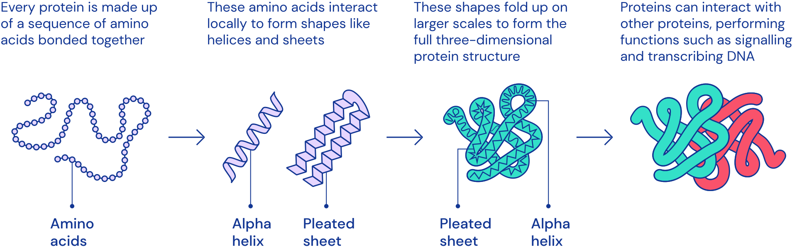

<footer>

[AlphaFold: Using AI for scientific discovery](https://www.deepmind.com/blog/alphafold-using-ai-for-scientific-discovery-2020)

</footer>

---

# Special Types of Proteins - Antibodies

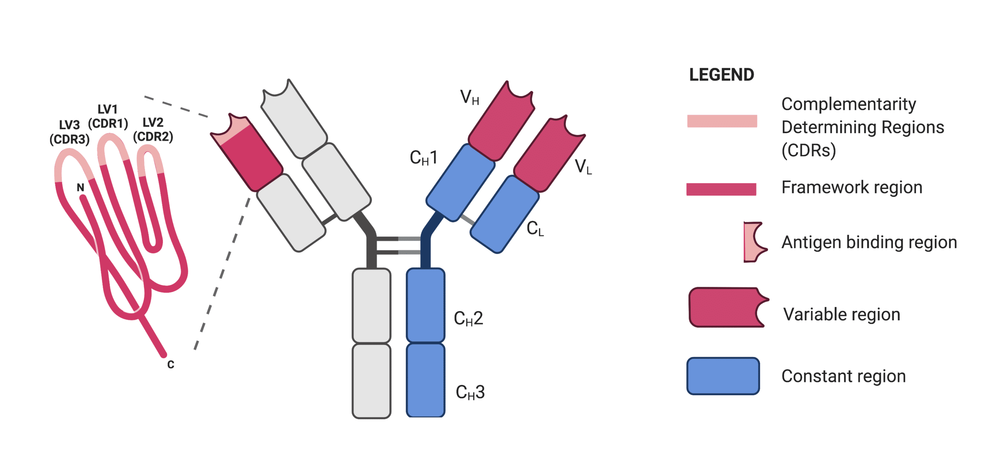

---

# But why protein-based therapeutics?

#### Proteins

- High Target Specificity
  - Lower Toxicity
  - Fewer side effects
  - Small range of targets
  - Limited drug-drug interactions
- Longer half-life
- Examples:
  - Monoclonal antibodies, hormones

#### Small Molecules

- Low Target Specificity
  - Higher Toxicity
  - More side effects
  - Wider range of targets
  - More drug-drug interactions
- Shorter half-life
- Examples:
  - Ibuprofen, lithium

---

# General Drug Discovery Pipeline

---

# What are some problems in de novo

- Given sequence, predict structure
  - AlphaFold, Rosetta
- Given structure, predict sequence
- Given function, predict structure

---

# What I did during internship

---

# Surface as representation of proteins

  

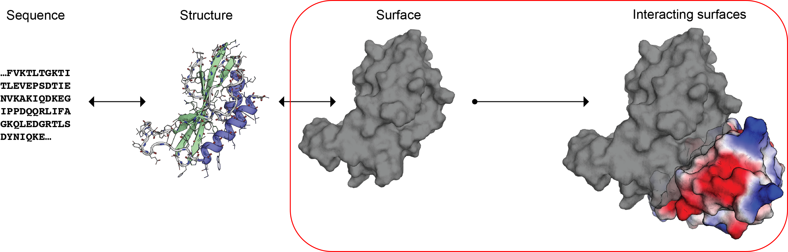

---

# Different Sequences & Structures but Same Surfaces

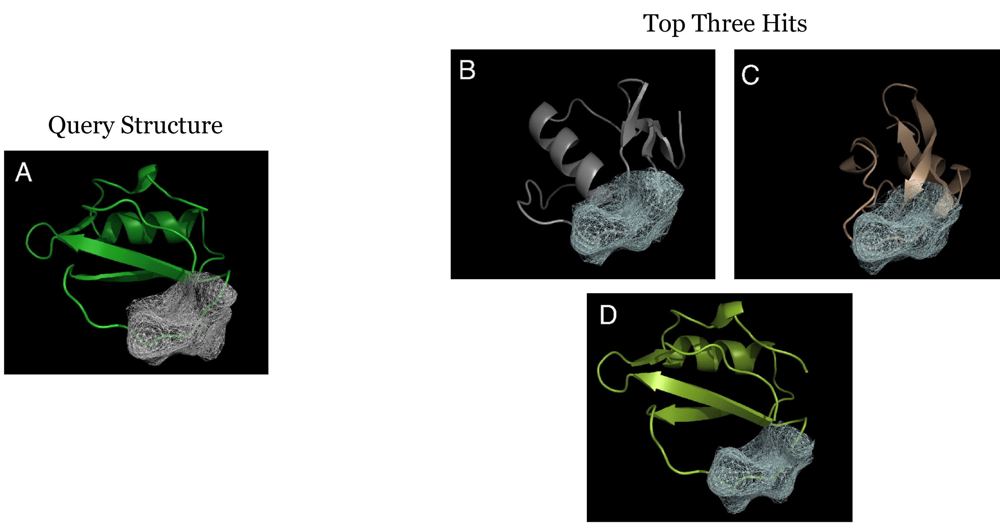

<footer>

[Yin, et al. "Fast screening of protein surfaces using geometric invariant fingerprints."](https://doi.org/10.1073/pnas.0906146106)

</footer>

---

   

<h1 align="center">Can we learn representations of the interacting surfaces?

---

# Point Cloud as Representation of the Surface

### Atoms in Space

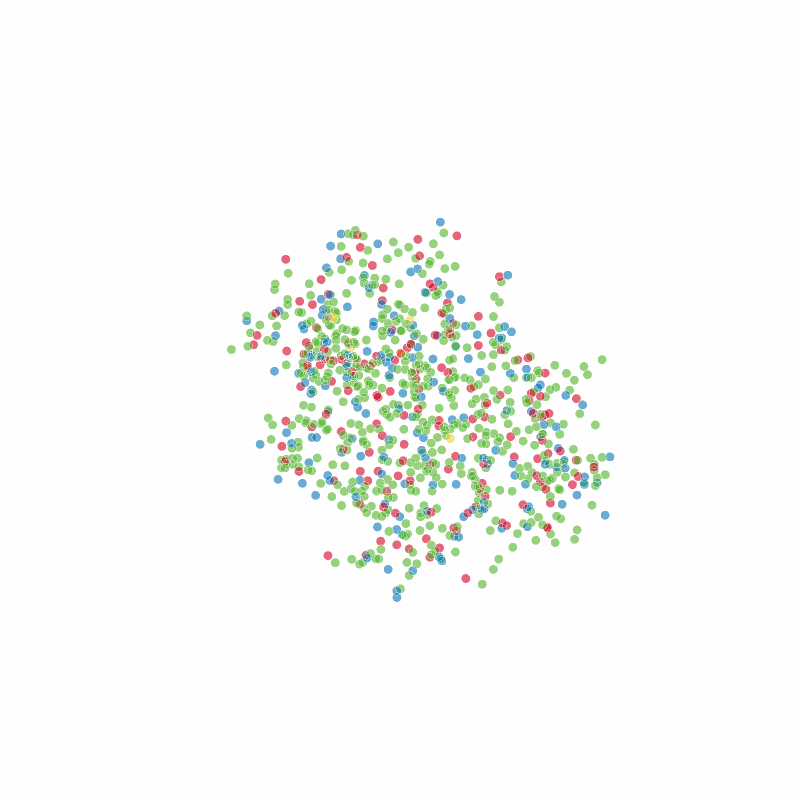

### Atoms + Surface Point Cloud

---

# Initial Chemical Features

Encoding Chemical Features

---

# Geodesic Convolutions

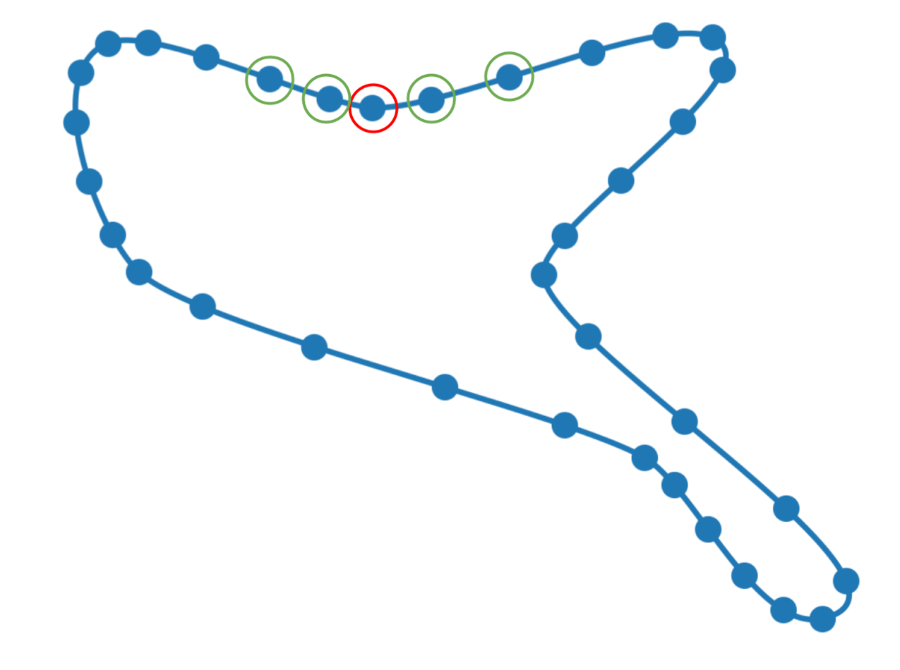

---

# Geodesic Convolutions

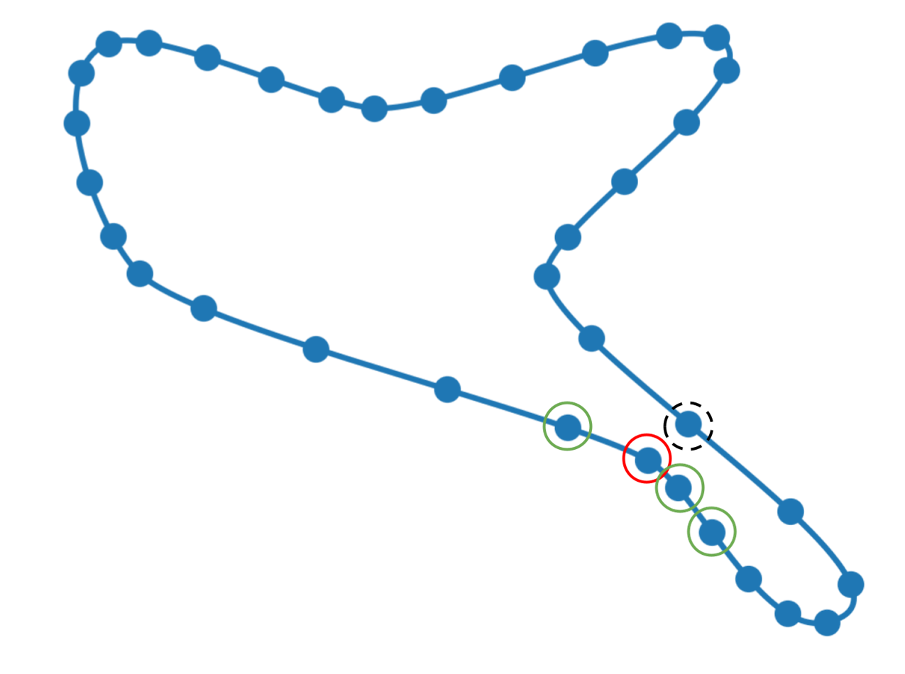

---

# Geodesic Convolutions

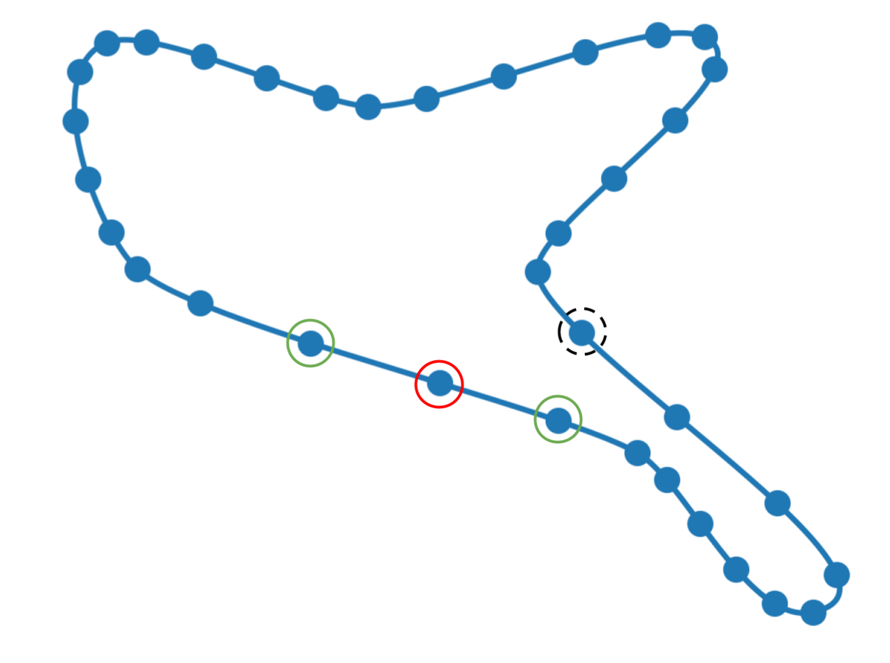

---

# True Interacting Points

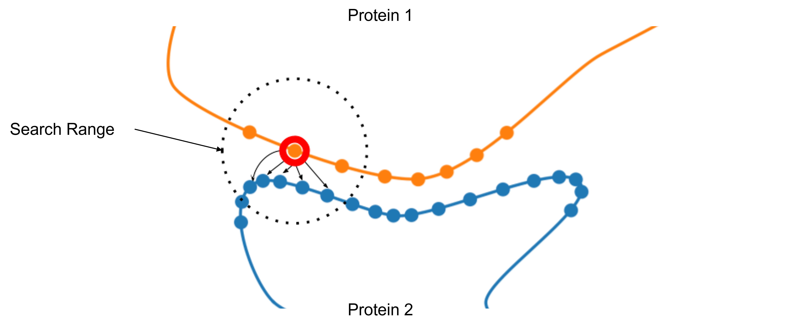

---

# True Interacting Points

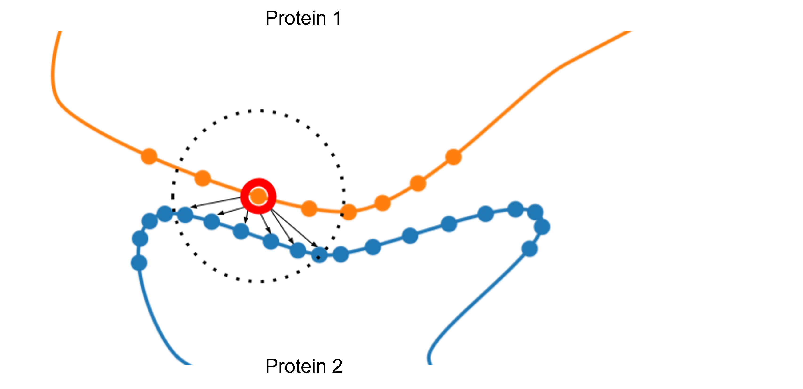

---

# True Interacting Points

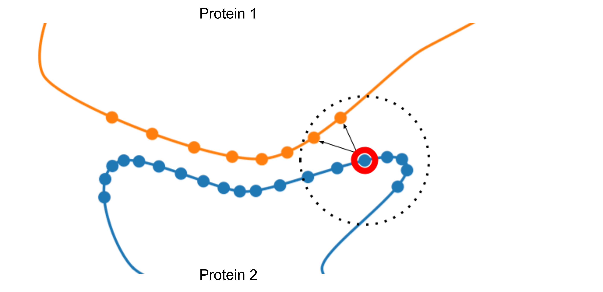

---

# True Interacting Points

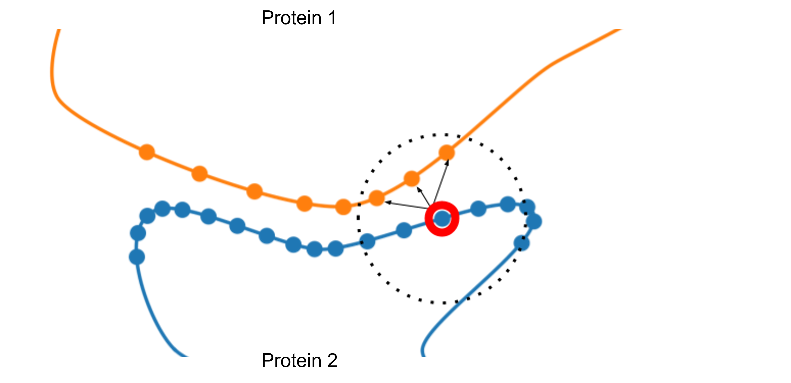

---

# Point Clouds of a Complex

### All Suface Points

### Only True Interacting Points

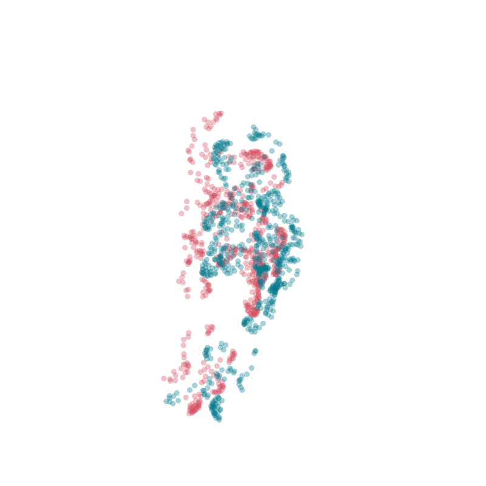

---

# Protein-Protein Interaction Search

---

# Triplet Sampling

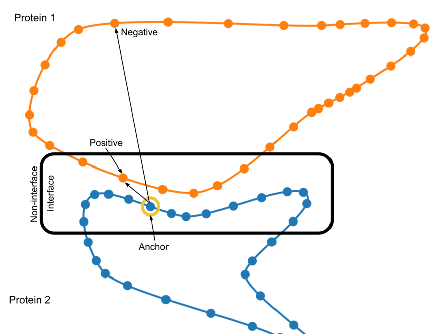

---

# Triplet Sampling

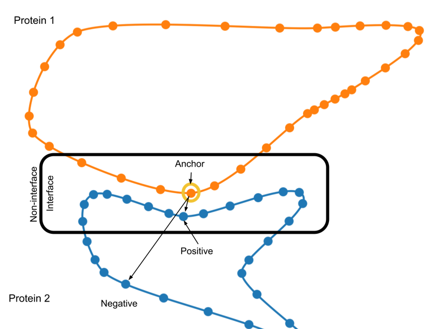

---

# Binding Site Identification

---

# Binding Site Identification

---

# Special Thanks

  

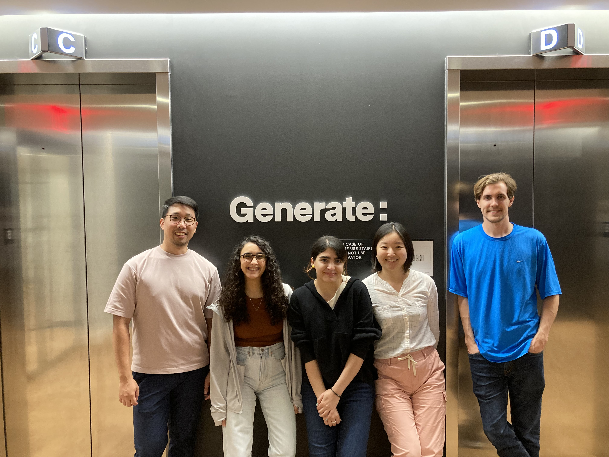
