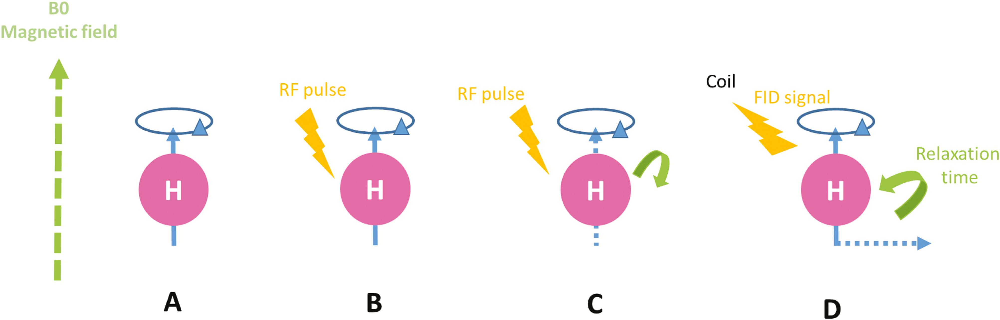
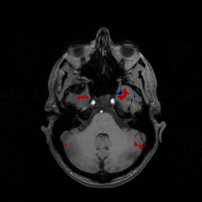
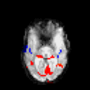
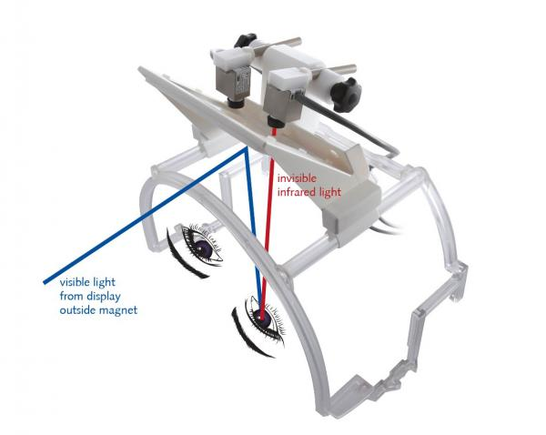
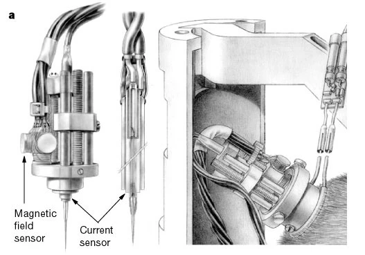
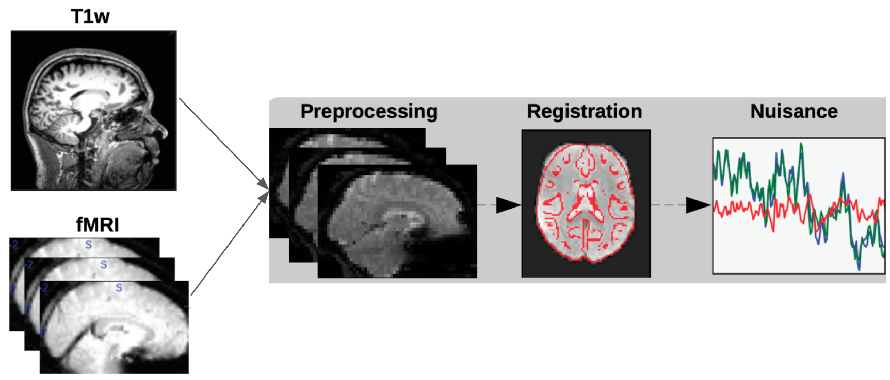
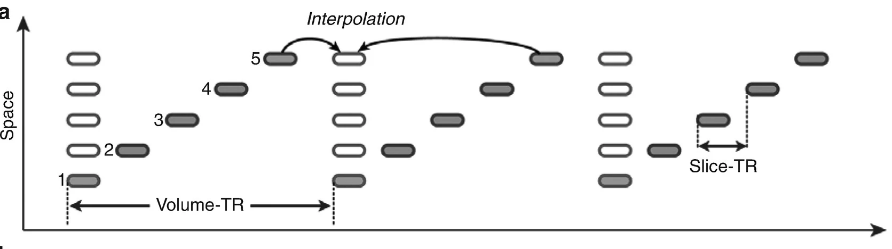
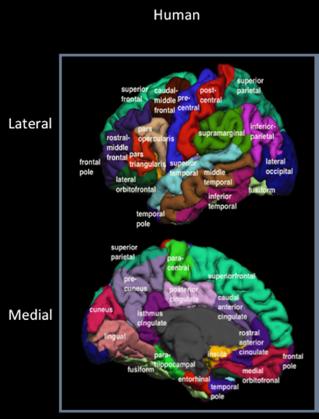
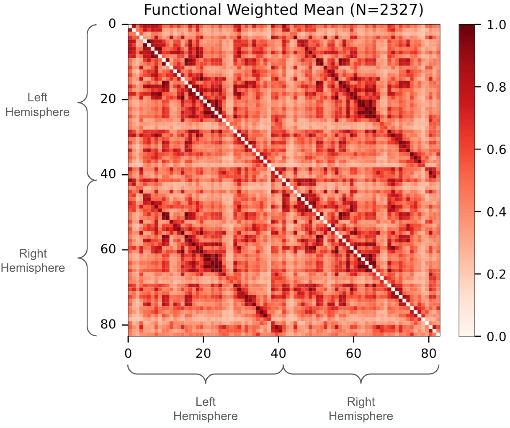

<!-- _paginate: false -->

# Functional MRI

## Jaewon Chung

_(he/him)_ - [NeuroData lab](https://neurodata.io/)
_Johns Hopkins University - Biomedical Engineering_

 [_j1c@jhu.edu_](mailto:j1c@jhu.edu)
 [_@j1c (Github)_](https://github.com/j1c)
 [_@j1c (Twitter)_](https://twitter.com/j1c)

---

# What is Magnetic Resonance Imaging (MRI)?

 

<footer>

[The development of brain magnetic resonance approaches in large animal models for preclinical research
](https://academic.oup.com/af/article/9/3/44/5522880)

</footer>

---

# MRI Parameters

- _Repetition Time (TR)_: Time between successive RF pulses
- _Echo Time (TE)_: Time between RF pulse and signal acquisition
- _Flip Angle_: Angle from initial alignment

  - Controlled by amplitude and duration of RF pulse

- One machine, different sequences, different 'modalities' of images

---

# Examples of Sequences

1. T1-weighted (T1w): Excellent for anatomical detail.
   - brain, internal organs
2. T2-weighted (T2w): Sensitive to fluid and inflammation.
   - cysts, tumors
3. Gradient Echo (GRE): Sensitive to blood products.
   - blood flow, hemorrhage, iron deposition
4. Diffusion-weighted Imaging (DWI): Sensitive to water diffusion.
   - white matter tracts, early onset stroke

---

# What is Functional MRI (fMRI)?

- Idea: Blood flow increases in active brain regions.
- Measurement: Blood Oxygenation Level Dependent (BOLD) signal
- Caveat: fMRI measures **relative** changes in blood flow!

---

# Task vs. Resting-State fMRI

- Resting-State fMRI: Subjects are at rest, no task
- Task fMRI: Subjects perform a task (e.g., finger tapping, watching video)

---

# Relationship Between Neural Activity and Blood Flow

Lots of evidence from animals and humans!

- Local field potentials (LFPs): measures electrical activity of nearby neurons
- Positive correlation between LFP and BOLD signal

<footer>

[Neurophysiological investigation of the basis of the fMRI signal](https://www.biorxiv.org/content/10.1101/2021.11.01.466686v2)
[Coupling between neuronal firing rate, gamma LFP, and BOLD fMRI is related to interneuronal correlations](https://doi.org/10.1016/j.cub.2007.06.066)

</footer>

---

# Processing fMRI Data

 

<footer>

[A low-resource reliable pipeline to democratize multi-modal connectome estimation and analysis](https://www.biorxiv.org/content/10.1101/2021.11.01.466686v2)

</footer>

---

# Preprocessing Steps

- Slice time correction
  - Corrects for differences in acquisition time between slices
  - Typically interpolated to the middle slice

 

---

# Preprocessing Steps

- Motion Correction: Aligns all volumes (timepoints) to a reference image
  - 1st image: Reference image
  - Motion parameters: translation and rotation
  - Some volumes may be discarded.

---

# Registration

1. Coregistration: Aligns the fMRI to the subject's high-resolution anatomical scan.
2. Normalization: Aligns subject's anatomical scan to standard space (e.g., MNI152 space) for group comparisons.

---

# Nuisance Correction

1. Bandpass filtering
   - Filtering out low and high frequencies
1. Cyclical detrending
   - Removing linear and quadratic trends
1. CompCor
   - Removing physiological noise (e.g., cardiac and respiratory signals)
   - Noise estimated from white matter and cerebrospinal fluid

---

# What is Functional Connectivity?

### Estimation

- Apply a parcellation
- Average BOLD signal within each region
- Compute correlation between regions

### Interpretation

- Meaures how brain regions are temporally correlated.
- Regions that fluctuate in together = functionally 'connected'

---

# Anatomy of Functional Connectome

- Ipsilateral: within the same hemisphere
- Contralateral: between hemispheres
- Homotopic: between mirror areas
- High correlation in homotopic connections

---

# Default Mode

---

# Yeo Networks

The Yeo 7 Networks are a commonly used brain parcellation scheme based on resting-state functional MRI (fMRI) data. They represent seven major functional networks in the human brain, associated with different cognitive processes. Here's a basic breakdown:

Visual Network: Processes visual information.
Somatomotor Network: Involved in sensory processing and motor control.
Dorsal Attention Network: Associated with top-down attention, directing focus towards specific stimuli.
Ventral Attention Network: Related to reorienting attention to unexpected or salient events.
Limbic Network: Involved in emotion processing and memory.
Frontoparietal Network: Important for flexible cognitive control, decision making, and working memory.
Default Mode Network: Engaged during internal thought, self-reflection, and mind-wandering.

---

# How were the Yeo 7 Networks estimated?

The Yeo 7 Networks were derived from a large-scale study involving resting-state fMRI data from 1,000 healthy individuals. Here's the general process:

Data Preprocessing: fMRI data was carefully cleaned and preprocessed to remove noise and artifacts.
Functional Connectivity Analysis: Researchers calculated correlations in brain activity (blood oxygen level fluctuations as measured by fMRI ) across different regions of the brain over time. Areas showing synchronized patterns of activity were considered functionally connected.

---

# Structure and Function

---

# Useful Links

- [MRI-to-graphs (m2g)](https://github.com/neurodata/m2g) - Our fMRI and dMRI pipeline for estimating connectomes
- [MRI Connectomes](https://neurodata.io/mri/) - Our processed connectomes using open-access datasets
- [Slides on Diffusion MRI](https://neurodata.io/talks/ndmg.pdf) - A brief overview of diffusion MRI pipeline in m2g.

---

     

<h1 align="center">Questions?

