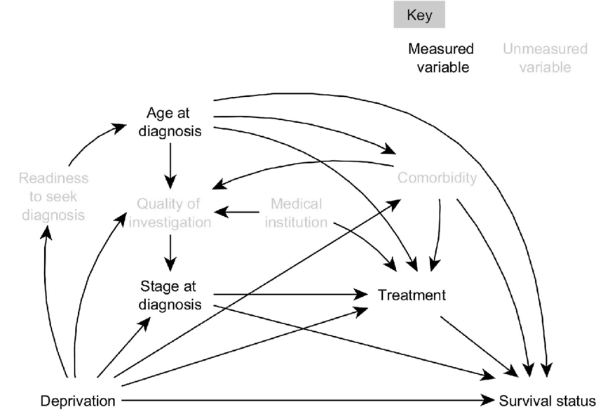
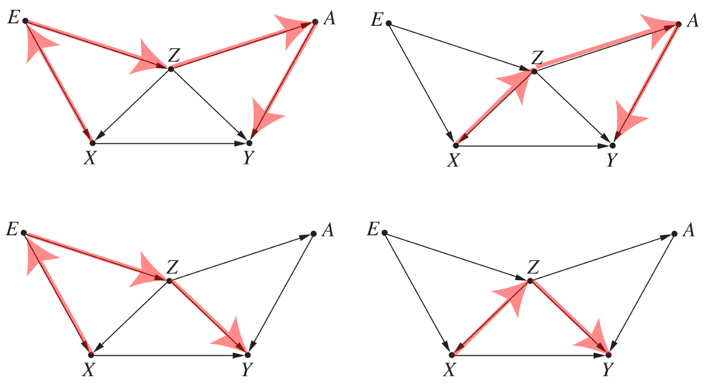

# Heritability of Human Structural Connectomes

## Jaewon Chung

_(he/him)_ - [NeuroData lab](https://neurodata.io/)
_Johns Hopkins University - Biomedical Engineering_

 [_j1c@jhu.edu_](mailto:j1c@jhu.edu)
 [_@j1c (Github)_](https://github.com/j1c)
 [_@j1c (Twitter)_](https://twitter.com/j1c)

---

# What is heritability?

- Variations in phenotype caused by variations in genotype.
- Potentially discover relationships between diseases and genetics.

     

## Are the patterns of brain connectivity heritable?

---

# Brain connectivity as connectomes

<!--  -->

(aka networks or graphs)

- Vertex: region of the brain
- Edges: connectivity measure between a pair of vertices
- Structural connectomes: estimated # of neuronal fibers
- Undirected: neurons have no direction

<footer>
Image from Gu, Zijin, et al. "Heritability and interindividual variability of regional structure-function coupling." (2021)
</footer>

---

# How do we get structural connectomes?

 

---

     

<h1 align="center">Quick detour to causal land

---

# Directed acyclic graphs

- Representation of causal relationships of variables
  - From domain knowledge

<footer>
Li, Ruoran, Rhian Daniel, and Bernard Rachet. "How much do tumor stage and treatment explain socioeconomic inequalities in breast cancer survival? Applying causal mediation analysis to population-based data." European journal of epidemiology 31.6 (2016): 603-611.
</footer>

---

# Confounding

- Common cause for both exposure and outcome
  - Exposure: alcohol consumption
  - Outcome: lung cancer
- Causes sprious association!
- Solution: "condition" confounding

---

# Toy example

- Smoking = $\mathcal{N}(5, 1)$
- Alcohol = Smoking + $\mathcal{N}(0, 1)$
- Lung Cancer = Smoking + $\mathcal{N}(0, 1)$
- n = 100

<!-- Test: Alcohol$\perp\!\!\!\!\perp$Smoking -->

|                      |                 Indep. Test                  |                 Conditional Indep. Test                 |
| -------------------- | :------------------------------------------: | :-----------------------------------------------------: |
| Null Hypothesis      |    Alcohol$\perp\!\!\!\!\perp$Lung cancer    |    Alcohol$\perp\!\!\!\!\perp$Lung cancer$\|$Smoking    |
| Alternate Hypothesis | Alcohol$\not\!\perp\!\!\!\!\perp$Lung cancer | Alcohol$\not\!\perp\!\!\!\!\perp$Lung cancer$\|$Smoking |
| Correlation ($r$)    |                $\approx 0.66$                |                     $\approx 0.006$                     |
| p-value              |                 $\approx 0$                  |                       $\approx 1$                       |

---

# Backdoor paths

- Non-causal path from exposure (X) to outcome (Y)
- Flow backwards out of exposure (arrow pointing towards exposure)
- Confounders create backdoor paths
- Path is blocked if a variable in the path is conditioned on.

---

# Examples

- Four possible paths
- Sufficient condition sets:
  - $\{Z \}$
  - $\{Z, E\}$
  - $\{Z, A\}$
  - $\{Z, E, A\}$

---

# Backdoor criterion

Causal effect exists between exposure ($X$) and outcome ($Y$) if:

1. No backdoor paths from $X$ to $Y$ exist
   - Typically plausible in randomized trials
2. Measured covariates $S$ block all backdoor paths from $X$ and $Y$

---

# Mediation

- Lies on the causal path between exposure and outcome
  - Exposure: grades
  - Outcome: happiness
  - Mediator: self-esteem
- Total effect: effect from both exposure and mediators
- Direct effect: effect only from exposure

---

# Toy example

- Grades = $\mathcal{N}(5, 1)$
- Self-esteem = Grades + $\mathcal{N}(0, 1)$
- Happiness = Grades + Self-esteem + $\mathcal{N}(0, 1)$
- n = 100

|                      |                Indep. Test                |                 Conditional Indep. Test                  |
| -------------------- | :---------------------------------------: | :------------------------------------------------------: |
| Null Hypothesis      |    Grades$\perp\!\!\!\!\perp$Happiness    |    Grades$\perp\!\!\!\!\perp$Happiness$\|$Self-esteem    |
| Alternate Hypothesis | Grades$\not\!\perp\!\!\!\!\perp$Happiness | Grades$\not\!\perp\!\!\!\!\perp$Happiness$\|$Self-esteem |
| Correlation ($r$)    |              $\approx 0.89$               |                      $\approx 0.63$                      |
| p-value              |                $\approx 0$                |                       $\approx 0$                        |

---

# Collider

- A variable causally influenced by two or more variables
- Conditioning on collider does not block path
- Solution: also condition on a parent

---

# Toy example

- X = $\mathcal{N}(5, 1)$
- Y = $\mathcal{N}(10, 1)$
- C = X + Y + $\mathcal{N}(0, 1)$

|                      |         Indep. Test          |      Conditional Indep. Test      |
| -------------------- | :--------------------------: | :-------------------------------: |
| Null Hypothesis      |    X$\perp\!\!\!\!\perp$Y    |    X$\perp\!\!\!\!\perp$Y$\|$C    |
| Alternate Hypothesis | X$\not\!\perp\!\!\!\!\perp$Y | X$\not\!\perp\!\!\!\!\perp$Y$\|$C |
| Correlation ($r$)    |       $\approx 0.003$        |          $\approx -0.66$          |
| p-value              |         $\approx 1$          |            $\approx 0$            |

---

# Heritability as causal problem

---

# Do genomes affect connectomes?

- Our hypothesis:
  $H_0: F($Connectome|Genome$) = F($Connectome$)$
  $H_A: F($Connectome|Genome$) \neq F($Connectome$)$

- Alternatively:
  $H_0: F($Connectome, Genome$) = F($Connectome$)F($Genome$)$
  $H_A: F($Connectome, Genome$) \neq F($Connectome$)F($Genome$)$

- Known as independence testing
- Test statistic: _distance correlation (dcorr)_
- Implication if false: there exists an associational heritability.

---

# Distance correlation

- Measures dependence between two _multivariate_ quantities.
  - For example: connectomes, genomes.
- Can detect nonlinear associations.
- Measures correlation between pairwise distances.

---

# Do genomes affect connectomes given covariates?

- Want to test:
  $H_0: F($Conn., Genome|Covariates$) = F($Conn.|Covariates$)F($Genome|Covariates$)$
  $H_A: F($Conn., Genome|Covariates$) \neq F($Conn.|Covariates$)F($Genome|Covariates$)$
- Known as conditional independence test
- Test statistic: Conditional distance correlation (cdcorr)
- Implication if false: there exists causal dependence of connectomes on genomes.

---

# Conditional distance correlation

- Augment distance correlation procedure with third distance matrix.

 

---

# How do we compare genomes?

- Neuroimaging twin studies do not sequence genomes.
- Coefficient of kinship ($\phi_{ij}$)
  - Probabilities of finding a particular gene at a particular location.
- d(Genome$_i$, Genome$_j$) = 1 - 2$\phi_{ij}$.

 

|   Relationship    |  $\phi_{ij}$  | $1-2\phi_{ij}$ |
| :---------------: | :-----------: | :------------: |
|    Monozygotic    | $\frac{1}{2}$ |      $0$       |
|     Dizygotic     | $\frac{1}{4}$ | $\frac{1}{2}$  |
| Non-twin siblings | $\frac{1}{4}$ | $\frac{1}{2}$  |
|     Unrelated     |      $0$      |      $1$       |

---

# How do we compare connectomes?

- Random dot product graph (RDPG)
  - Each vertex (region of interest) has a low $d$ dimensional latent vector (position).
  - Estimate latent position matrix $X$ via adjacency spectral embedding.
  <!-- - $P[i\rightarrow j]$ = $\langle x_i, x_j\rangle$ -->

- d(Connectome$_k$, Connectome$_l$) = $||X^{(k)} - X^{(l)}R||_F$

---

# Neuroanatomy (mediator), Age (confounder)

- Literature show:
  - neuroanatomy (e.g. brain volume) is highly heritable.
  - age affects genomes and potentially connectomes
- d(Covariates$_i$, Covariates$_j$) = ||Covariates$_i$ - Covariates$_j$||$_F$

---

# Human Connectome Project

- Brain scans from identical (monozygotic), fraternal (dizygotic), non-twin siblings.
- Regions defined using Glasser parcellation (180 regions).

 

<footer>
Van Essen, David C., et al., The WU-Minn human connectome project: an overview (2013)

Glasser, Matthew F., et al. "A multi-modal parcellation of human cerebral cortex." Nature (2016).

</footer>

---

# Associational Test for Connectomic Heritability

- $H_0: F($Connectome, Genome$) = F($Connectome$)F($Genome$)$
  $H_A: F($Connectome, Genome$) \neq F($Connectome$)F($Genome$)$

 

|   Sex   |      **All**      |    **Females**    |     **Males**     |
| :-----: | :---------------: | :---------------: | :---------------: |
| p-value | $<1\times10^{-5}$ | $<1\times10^{-3}$ | $<1\times10^{-2}$ |

---

# Associational Test for Neuroanatomy

- $H_0: F($Neuroanatomy, Genome$) = F($Neuroanatomy$)F($Genome$)$
  $H_A: F($Neuroanatomy, Genome$) \neq F($Neuroanatomy$)F($Genome$)$

 

|   Sex   |      **All**      |    **Females**    |     **Males**     |
| :-----: | :---------------: | :---------------: | :---------------: |
| p-value | $<1\times10^{-3}$ | $<1\times10^{-2}$ | $<1\times10^{-2}$ |

---

# Causal Test for Connectomic Heritability

- $H_0: F($Conn., Genome|Covariates$) = F($Conn.|Covariates$)F($Genome|Covariates$)$
  $H_A: F($Conn., Genome|Covariates$) \neq F($Conn.|Covariates$)F($Genome|Covariates$)$

 

|   Sex   |      **All**      |    **Females**    |     **Males**     |
| :-----: | :---------------: | :---------------: | :---------------: |
| p-value | $<1\times10^{-2}$ | $<1\times10^{-2}$ | $<1\times10^{-2}$ |

---

# Summary

- Present a causal model for heritability of connectomes.
- Leveraged recent advances:
  1. Statistical models for networks, allowing meaningful comparison of connectomes.
  2. Distance and conditional distance correlation as test statistic for causal analysis$^1$.
- Connectomes are dependent on genome, suggesting heritability.

<footer>

$^1$ Bridgeford, Eric W., et al. "Batch Effects are Causal Effects: Applications in Human Connectomics." (2021).

</footer>
