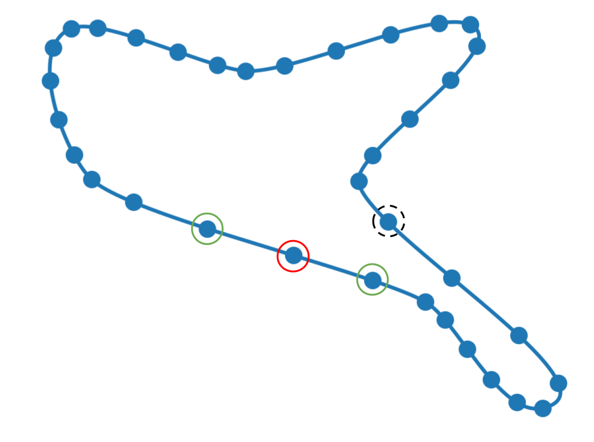

# _De novo_ Protein Design

## Jaewon Chung

_(he/him)_ - [NeuroData lab](https://neurodata.io/)
_Johns Hopkins University - Biomedical Engineering_

 [_j1c@jhu.edu_](mailto:j1c@jhu.edu)
 [_@j1c (Github)_](https://github.com/j1c)
 [_@j1c (Twitter)_](https://twitter.com/j1c)

---

# Outline

1. Where I interned
2. General drug discover pipeline
3. Protein basics
4. What I did during internships
5.

---

# What are proteins?

---

# Why do we care about proteins?

---

# What is protein design?

---

# What are some problems in de novo

---

# What I did during internship

---

# Different Sequences & Structures but Same Surfaces

<footer>

[Yin, et al. "Fast screening of protein surfaces using geometric invariant fingerprints."](https://doi.org/10.1073/pnas.0906146106)

</footer>

---

     

<h1 align="center">Can we learn representations of the interacting surfaces?

---

# Point Cloud as Representation of the Surface

---

# Geodesic Convolutions

---

# Geodesic Convolutions

---

# Geodesic Convolutions

---

# True Interacting Points

---

# Point Clouds of a Complex

---

# Protein-Protein Interaction Search

---

# Triplet Sampling

---

# Binding Site Identification

---

# Binding Site Identification
