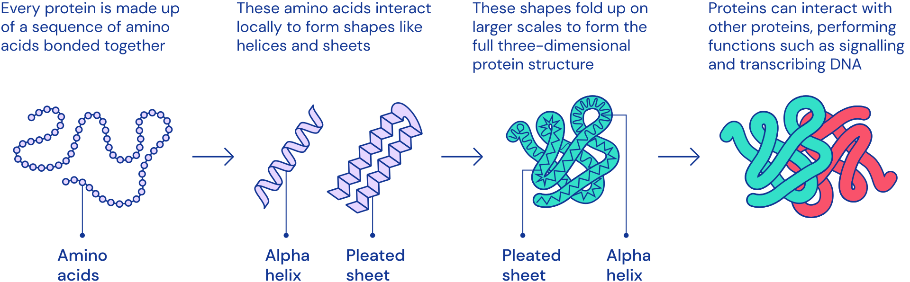

# Proteins

## Jaewon Chung

_(he/him)_ - [NeuroData lab](https://neurodata.io/)
_Johns Hopkins University - Biomedical Engineering_

 [_j1c@jhu.edu_](mailto:j1c@jhu.edu)
 [_@j1c (Github)_](https://github.com/j1c)
 [_@j1c (Twitter)_](https://twitter.com/j1c)

---

# Generate: Biomedicines

- Designs and develops protein therapeutics
- Uses **generative AI** 🤯🤯🤯
- \>$600M in funding 💰💰💰
- Backed by Flagship Pioneering
  - Founded Moderna 💊💊💊
- Located in Somerville, MA

---

# What are proteins?

 

<footer>

[AlphaFold: Using AI for scientific discovery](https://www.deepmind.com/blog/alphafold-using-ai-for-scientific-discovery-2020)

</footer>

---

# Special Types of Proteins - Antibodies

---

# But why protein-based therapeutics?

#### Proteins

- High Target Specificity
  - Lower Toxicity
  - Fewer side effects
  - Small range of targets
  - Limited drug-drug interactions
- Longer half-life
- Examples:
  - Monoclonal antibodies, hormones

#### Small Molecules

- Low Target Specificity
  - Higher Toxicity
  - More side effects
  - Wider range of targets
  - More drug-drug interactions
- Shorter half-life
- Examples:
  - Ibuprofen, lithium

---

# General Drug Discovery Pipeline

1. Target Identification and Validation (what disease/condition?)
   - Generate has its own business department; partners with other companies
1. Lead Discovery (what drug candidates?)
   - Generate uses Chroma (diffusion-based protein generative model)
   - Given candidates, test binding affinity, selectivity, obtain structure.
   - Use data to update Chroma.
1. Lead Optimization (can we make some candidates better?)
   - Iterative optimization to improve binding affinity, selectivity.
1. Preclinical Development (is it safe?)
1. Clinical Development (is it safe in humans?)

<footer>

[Illuminating protein space with a programmable generative model](https://www.biorxiv.org/content/10.1101/2022.12.01.518682v1)

</footer>

---

# What are some open problems in protein prediction?

#### Single Protein

- Given sequence, predict structure
  - AlphaFold, Rosetta
- Given sequence, predict function
  - Large language models (ProteinBert)
- Given function, predict sequence and/or structure

#### Protein Complex

- Given two structures, predict complex structure
  - Protein docking
- Given two structures, predict binding sites

---

# What did I do?

- Mainly worked on interaction prediction.

---

# Surface as representation of proteins

  

---

# Different Sequences & Structures but Same Surfaces

<footer>

[Yin, et al. "Fast screening of protein surfaces using geometric invariant fingerprints."](https://doi.org/10.1073/pnas.0906146106)

</footer>

---

# Different Sequences & Structures but Same Surfaces

- Compared to query **A**

 

| Structure | Sequence Alignment Score | Structure Aligment Score | Surface Alignment Score |
| :-------: | :----------------------: | :----------------------: | :---------------------: |
|     B     |           .23            |           .35            |          2.85           |
|     C     |           .34            |           .32            |          3.10           |
|     D     |           .85            |           .78            |          2.96           |

---

    

<h1 align="center">Can we learn representations of the interacting surfaces?

---

# Protein-Protein Interaction

  

---

# Point Cloud as Representation of the Surface

### Atoms in Space

### Atoms + Surface Point Cloud

---

# Initial Point Cloud Features

### Chemical Features

### Geometric Features

---

# Geodesic Convolutions

---

# Geodesic Convolutions

---

# True Interacting Points

---

# True Interacting Points

---

# True Interacting Points

---

# True Interacting Points

---

# Point Clouds of a Complex

### All Suface Points

### Only True Interacting Points

---

# Triplet Sampling

---

# Triplet Sampling

---

# Structural Antibody Database (SAbDab)

- ~1400 antibody/antigen structures from PDB
- Data splits:

  - Based on antigen clustering
  - ~1000 train
  - ~200 validation
  - ~200 test

- Result: Close to state of the art

---

# Special Thanks

 

