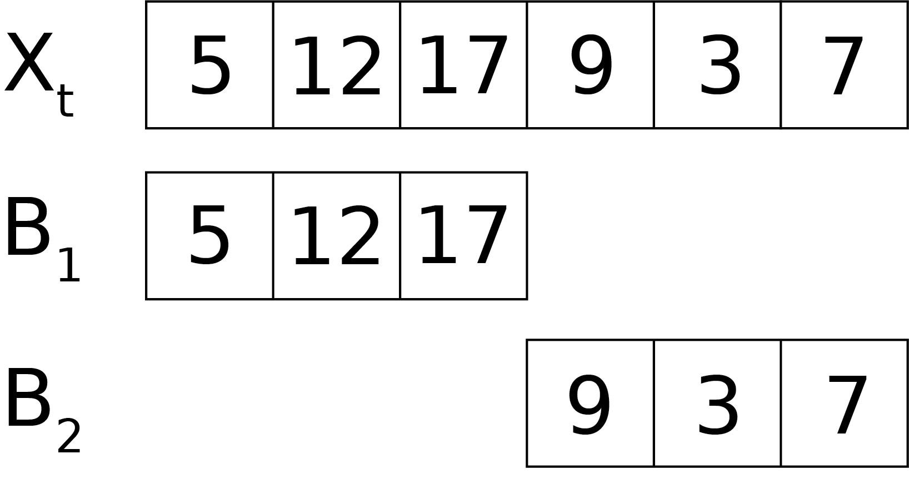
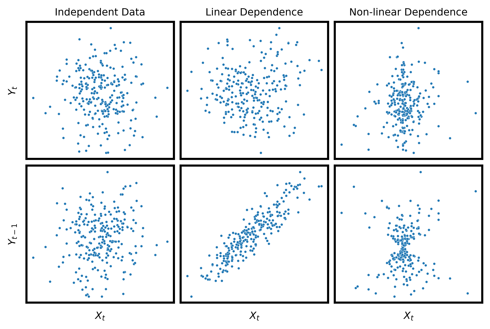
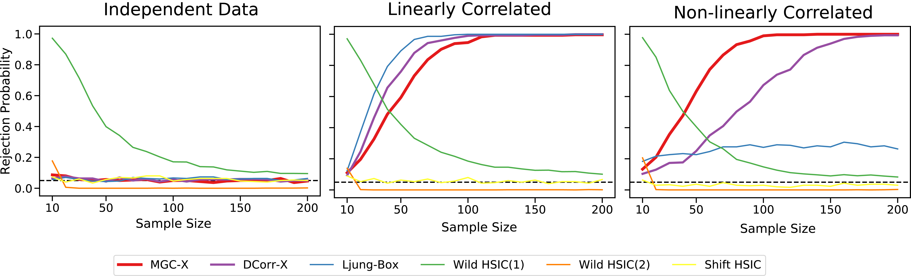
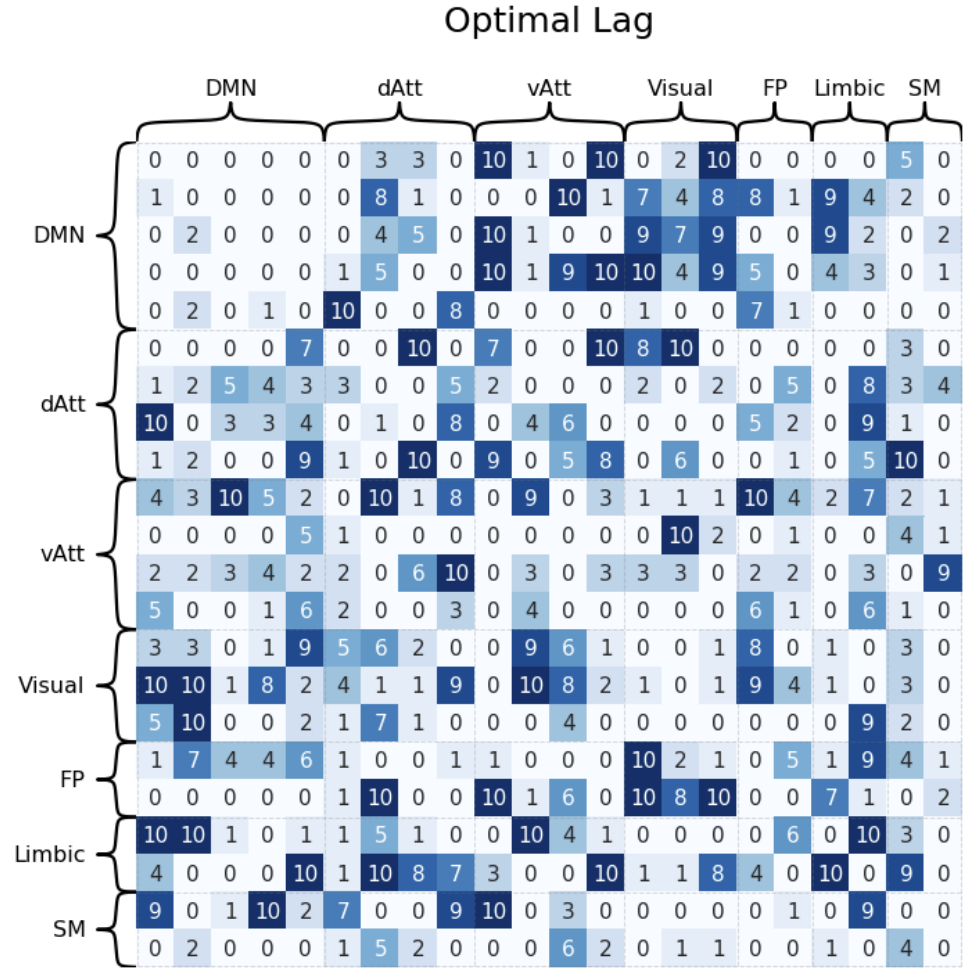

# :magic_wand: MGC-X :magic_wand:

## Jaewon Chung

_(he/him)_ - [NeuroData lab](https://neurodata.io/)
_Johns Hopkins University - Biomedical Engineering_

 [_j1c@jhu.edu_](mailto:j1c@jhu.edu)
 [_@j1c (Github)_](https://github.com/j1c)
 [_@j1c (Twitter)_](https://twitter.com/j1c)

---

# Motivation

- Observe several time series evolving simultaneously
- Analyzing each component individually can lead to wrong inference.

---

# Independence Testing

Let $(X_i, Y_i) \sim F_{XY}, i \in [n] = \{1, 2, \ldots, n\}$

We want to test:

$$
\begin{aligned}
H_0: &\ F_{XY} = F_{X}F_{Y}\\
H_A: &\ F_{XY} \neq F_{X}F_{Y}
\end{aligned}
$$

---

# Indepdence Testing in Time-series data

- Let $(X_t, Y_t) \sim F_{XY}, \ t \in [n] = \{1, 2, \ldots, n\}$

- Maximum lag $M$.

$$
\begin{aligned}
H_0: &\ F_{X_t, Y_{t-j}} = F_{X_t}F_{Y_{t-j}} \ \text{for each $j\in\{0, 1, \ldots, M\}$} \\
H_A: &\ F_{X_t, Y_{t-j}} \neq F_{X_t}F_{Y_{t-j}} \ \text{for some $j\in\{0, 1, \ldots, M\}$}
\end{aligned}
$$

- Assymetric test

---

# Stationary Process

A time series $\{X_t\}$ is **strictly stationary** if the joint distribution of $(X_{t_1}, X_{t_2}, \ldots , X_{t_n})$ is the same as that of $(X_{t_{1+\tau}}, X_{t_{2+\tau}}, \ldots , X_{t_{n+\tau}})$.

- $t, \tau\in \mathbb{R}$, $n\in\mathbb{N}_{>0}$

Consquently,

- $\mathbb{E}(X_t)$ is constant, does not depend on $t$
- If $\mathbb{E}(X_t^2) <\infty$, $Cov(X_t, X_{t-\tau})$ only depends on $\tau$

Above two conditions form the **weakly stationary**.

---

# Auto-covariance/correlation (ACVF/ACF)

Let $\{X_i\}_1^t$, $X_i \in \mathbb{R}$ be stationary time-series.

- Auto-covariance function (ACVF)
  - Time dependent covariance with itself

$$
\begin{align*}
ACVF(j) &= Cov(X_t, X_{t-j})\\
\end{align*}
$$

- Auto-correlation function (ACF)
  - Time dependent correlation with itself

$$
\begin{align*}
ACF(j) &= \frac{Cov(X_t, X_{t-j})}{\sqrt{Var(X_t)Var(X_{t-j})}} \\
&= \frac{ACVF(j)}{ACVF(0)} \tag{Stationarity of $X_t$}
\end{align*}
$$

---

# Cross-covariance/correlation (CCVF/CCF)

Let $\{(X_i, Y_i)\}_1^t$, $X_i, Y_i \in \mathbb{R}$ stationary time-series.

- Cross-covariance function (CCVF)
  - Time dependent covariance between two time series

$$
\begin{align*}
CCVF(j) &= Cov(X_t, Y_{t-j})
\end{align*}
$$

- Cross-correlation function (CCF)
  - Time dependent correlation between two time series

$$
\begin{align*}
CCF(j) &= \frac{Cov(X_t, Y_{t-j})}{\sqrt{Var(X_t)Var(Y_{t-j})}} \\
&= \frac{CCF(j)}{\sqrt{ACVF_{X_t}(0)ACVF_{Y_t}(0)}}
\end{align*}
$$

---

# Ljung-Box Test (pronounced Yoong)

- Max lag $M$
- Originally for autocorrelated time-series data.

  $$
  \begin{align*}
  T &= n(n+2) \sum_{j=1}^M \frac{ACF^2(j)}{n-j}\\
  \end{align*}
  $$

- Modified for cross-correlated time-series data.

  $$
  \begin{align*}
  T &= n(n+2) \sum_{j=1}^M \frac{CCF^2(j)}{n-j}\\
  \end{align*}
  $$

---

# Distance Based Test

- Max lag $M$
- Distance cross correlation

  $$
    \begin{align*}
    DCorr(j) &:= DCorr(X_t, Y_{t-j})\\
    DCorrX &=  \sum_{j=1}^M \frac{n-j}{n}\cdot DCorr(j)\\
    \end{align*}
  $$

- Multiscale graph cross correlation
  $$
      \begin{align*}
      MGC(j) &:= MGC(X_t, Y_{t-j})\\
      MGCX &=  \sum_{j=1}^M \frac{n-j}{n}\cdot MGC(j)\\
      \end{align*}
  $$

---

# Optimal Lag

- Lag $j$ that exhibits the strongest dependence.

$$
\begin{align*}
\hat M^* &= \arg\max_j \left(\frac{n-j}{n}\right) \cdot T(j)\\
\end{align*}
$$

---

# Block Permutation Test

- Dependent data &rarr; cannot use standard permutation.

Procedure: Given number of blocks size $b < n$,

1. For each block $i\in 1, 2, \ldots, \lceil{n/b}\rceil$, produce block:

   $$
   \begin{align*}
   B_i &= (Y_{b(i-1)+1}, Y_{b(i-1)+2}, \ldots, Y_{b(i-1)+ b})\\
   \end{align*}
   $$

2. Choose $\lceil{n/b}\rceil$ blocks from $B_0, B_1, \ldots, B_{\lceil{n/b}\rceil}$ with replacement.

3. Concatenate the chosen blocks to form a new time series $Y'$.

4. Compute $T_n^{(r)}$ on the series $\{(X_t, Y'_t)\}_1^n$. Repeat $r$ times.

5. Compute $p$-value as:

   $$
   \begin{align*}
   p &= \frac{1}{r}\sum_{i=1}^r \mathbb{I}\{T_n^{(r)} \geq T_n\}\\
   \end{align*}
   $$

---

# Block Permutation Visualization

- $n=6$, $b=3$

---

# Simulations

1. Independent data
   $$
    \begin{bmatrix}
    X_t\\
    Y_t
    \end{bmatrix}
    =
    \begin{bmatrix}
    \phi & 0\\
    0 & \phi
    \end{bmatrix}
    \begin{bmatrix}
    X_{t-1}\\
    Y_{t-1}
    \end{bmatrix}
    +
    \begin{bmatrix}
    \epsilon_t\\
    \eta_t
    \end{bmatrix}
   $$
2. Linear dependence

   $$
    \begin{bmatrix}
    X_t\\
    Y_t
    \end{bmatrix}
    =
    \begin{bmatrix}
    0 & \phi\\
    \phi & 0
    \end{bmatrix}
    \begin{bmatrix}
    X_{t-1}\\
    Y_{t-1}
    \end{bmatrix}
    +
    \begin{bmatrix}
    \epsilon_t\\
    \eta_t
    \end{bmatrix}
   $$

3. Non-linear dependence
   $$
    \begin{bmatrix}
    X_t\\
    Y_t
    \end{bmatrix}
    =
    \begin{bmatrix}
    \epsilon_t Y_{t-1}\\
    \eta_t
    \end{bmatrix}
   $$

---

# Visualizations

---

# Results

 
 

---

# Optimal lag estimation

- Data dependent on lag 3.

  $$
   \begin{bmatrix}
   X_t\\
   Y_t
   \end{bmatrix}
   =
   \begin{bmatrix}
   \epsilon_t Y_{t-3}\\
   \eta_t
   \end{bmatrix}
  $$

---

# Real world data

- Resting state(?) fMRI data
- n=1200 frames, $\approx$ 0.75 second per frame.

- 22 brain regions, each part of some [large-scale brain network](https://en.wikipedia.org/wiki/Large-scale_brain_network).

      - Default Mode Network (DMN)
      - Dorsal Attention Network (dAtt)
      - Ventral Attention Network (vAtt)
      - Visual Network (Visual)
      - FrontoParietal Network (FP)
      - Limbic Network (Limbic)
      - Somatomotor Network (SM)

---

| Network           | Shorthand | Activation?                                              |
| ----------------- | --------- | -------------------------------------------------------- |
| Default Mode      | DMN       | When resting                                             |
| Dorsal Attention  | dAtt      | Selecting stimuli relevant to a goal                     |
| Ventral Attention | vAtt      | Detecting and redirecting attention to relevant stimuli  |
| Visual            | Visual    | Analyzing the various components of the visual scene     |
| FrontoParietal    | FP        | Making decisions in the context of goal-driven behaviour |
| Limbic            | Limbic    | Emotion, consciousness, motivation and long-term memory  |
| Somatomotor       | SM        | Detecting somatosensory stimuli, movement                |

 

---

| Network           | Shorthand | Activation?                                              |
| ----------------- | --------- | -------------------------------------------------------- |
| Default Mode      | DMN       | When resting                                             |
| Dorsal Attention  | dAtt      | Selecting stimuli relevant to a goal                     |
| Ventral Attention | vAtt      | Detecting and redirecting attention to relevant stimuli  |
| Visual            | Visual    | Analyzing the various components of the visual scene     |
| FrontoParietal    | FP        | Making decisions in the context of goal-driven behaviour |
| Limbic            | Limbic    | Emotion, consciousness, motivation and long-term memory  |
| Somatomotor       | SM        | Detecting somatosensory stimuli, movement                |

 

---

# TODO

- Multivariate simulations
