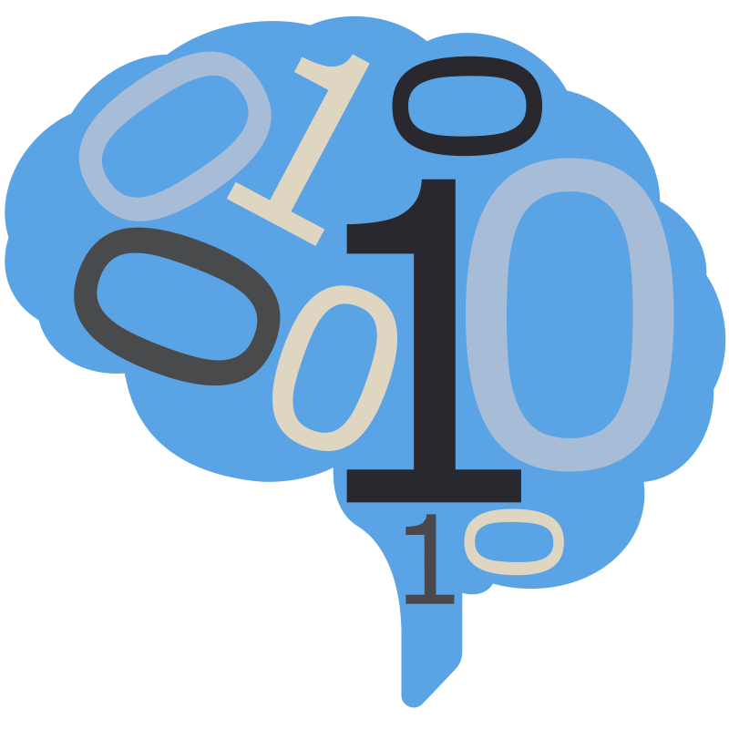

# Functional Connectivity

## Jaewon Chung

_(he/him)_ - [NeuroData lab](https://neurodata.io/)
_Johns Hopkins University - Biomedical Engineering_

 [_j1c@jhu.edu_](mailto:j1c@jhu.edu)
 [_@j1c (Github)_](https://github.com/j1c)
 [_@j1c (Twitter)_](https://twitter.com/j1c)

---

# Outline

1. What is fMRI?
2. How fMRI Works
3. fMRI Applications
4. Data processing

---

# What is fMRI?

---

# How fMRI Works

---

# fMRI Applications

fMRI is widely used to study:
Cognitive processes (memory, language, decision-making)
Sensory and motor functions
Brain development
Neurological and psychiatric conditions

---

# Resting-State fMRI

Subjects are asked to stay still and relaxed, often with their eyes closed.
fMRI scans measure the brain activity that occurs naturally at rest.
Functional connectivity analyses reveal intrinsic brain networks present even without a specific task.

---

# What is Functional Connectivity?

Functional connectivity examines how different brain regions are temporally correlated.
Regions that fluctuate in activity together are considered functionally 'connected.'
This reflects networks of brain areas working in concert.

---

# Functional Connectivity Applications

Mapping healthy brain networks
Investigating brain development across the lifespan
Identifying network changes in neurological and psychiatric conditions
Potential for clinical diagnosis and tracking treatment effectiveness

---

# Yeo Networks

The Yeo 7 Networks are a commonly used brain parcellation scheme based on resting-state functional MRI (fMRI) data. They represent seven major functional networks in the human brain, associated with different cognitive processes. Here's a basic breakdown:

Visual Network: Processes visual information.
Somatomotor Network: Involved in sensory processing and motor control.
Dorsal Attention Network: Associated with top-down attention, directing focus towards specific stimuli.
Ventral Attention Network: Related to reorienting attention to unexpected or salient events.
Limbic Network: Involved in emotion processing and memory.
Frontoparietal Network: Important for flexible cognitive control, decision making, and working memory.
Default Mode Network: Engaged during internal thought, self-reflection, and mind-wandering.

---

# How were the Yeo 7 Networks estimated?

The Yeo 7 Networks were derived from a large-scale study involving resting-state fMRI data from 1,000 healthy individuals. Here's the general process:

Data Preprocessing: fMRI data was carefully cleaned and preprocessed to remove noise and artifacts.
Functional Connectivity Analysis: Researchers calculated correlations in brain activity (blood oxygen level fluctuations as measured by fMRI ) across different regions of the brain over time. Areas showing synchronized patterns of activity were considered functionally connected.

---

# Limitations

fMRI measures blood flow (an indirect measure of neural activity)
Temporal resolution is relatively low (seconds) compared to the speed of brain processes (milliseconds).

- Participants have to lie completely still while in an fMRI.
